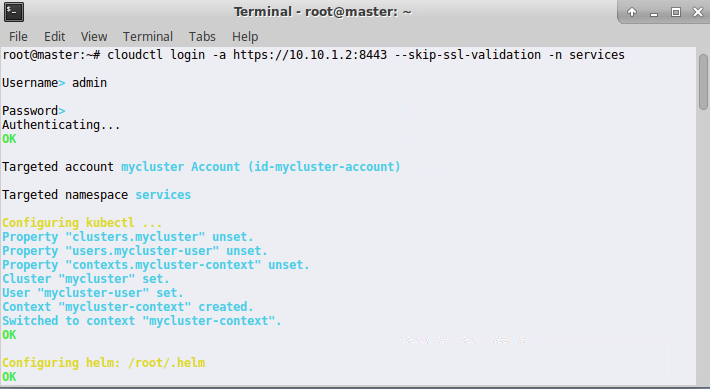
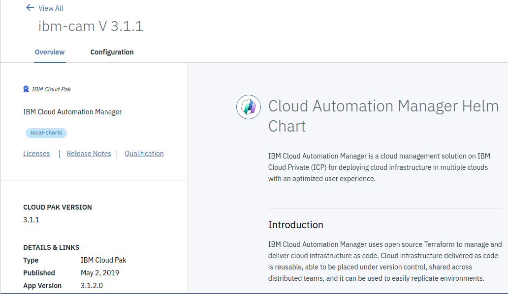
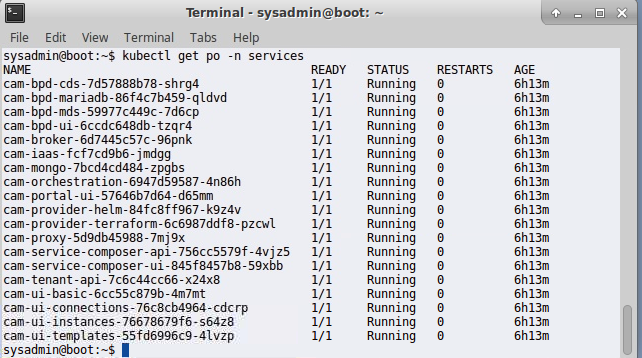

# CAM Enterprise Edition Install

In this lab we will install Cloud Automation Manager 3.1.2. 

## Load the Passport Advantage Archive (PPA)

In this section we will walk through the process of authenticating to the ICP environment from the command line and load the PPA archive for CAM. This load process will import the CAM docker images and charts so we can install CAM.

Note: Execute this section from the **Master** node.

1. open the **Master** node and login as sysadmin (passw0rd)

2. Open a terminal and enter the following command to run as 'root' (passw0rd)

   ```
    sudo su -
   ```

   upon a successful login you will see the following.

   

3. Login to ICP from the command line via the **cloudctl** command (admin/passw0rd)

Note: We are specifying the namespace of "services" which is the namespace where will be installing CAM 

```
cloudctl login -a https://10.10.1.2:8443 --skip-ssl-validation -n services
```

4. Login to the ICP docker registry from the command line (admin/passw0rd)

```
docker login mycluster.icp:8500
```

5. Load the PPA archive via the **cloudctl** command

Note: We have installed the PPA archive for you and placed it in the /cam_images directory on the Master node. This should be available to you on your corporate PPA account and be available for download outside this course.

```
cloudctl catalog load-archive --archive /cam_images/icp-cam-x86_64-3.1.2.0.tar.gz
```

6. This command can take some time to complete (about 15 min)


## Create Persistent Volumes

In this section we will create the backend persistant volumes required by CAM. In this environment we will be using NFS for our backed storage. The exports have been created for already and we are using the NFS node in SkyTap as our NFS server.

The following NFS exports have been created to support our persitent volumes.

```
/export *(rw,insecure,no_subtree_check,async)
/export/CAM_logs *(rw,nohide,insecure,no_subtree_check,async)
/export/CAM_db *(rw,nohide,insecure,no_subtree_check,async)
/export/CAM_terraform *(rw,nohide,insecure,no_subtree_check,async)
/export/CAM_BPD_appdata *(rw,nohide,insecure,no_subtree_check,async)
```

In this section we will be create four ICP PVs that correspond with the NFS exports above.

- cam-bpd-appdata-pv
- cam-logs-pv
- cam-mongo-pv
- cam-terraform-pv


### Execute the following commands to create your CAM PVs

Note: Execute these commands from the **Boot** node

1. open the **Boot** node and login  as sysadmin (passw0rd)
2. Open a terminal and authenticate to ICP from the command line using (admin/passw0rd).

```
cloudctl login -a https://10.10.1.2:8443 --skip-ssl-validation -n services
```

​	If successful you should see the same screen as show above in step 2

3. Copy and paste the following 4 commands below, to create the Persistant Volumes.

command for **cam-mongo-pv**
```
kubectl create -f - <<EOF
"kind": "PersistentVolume"
"apiVersion": "v1"
"metadata":
  "name": "cam-mongo-pv"
  "labels":
    "type": "cam-mongo"
"spec":
  "capacity":
    "storage": "15Gi"
  "accessModes":
     - "ReadWriteMany"
  "nfs":
    "server": "10.10.1.6"
    "path": "/export/CAM_db"
EOF
```

command for **cam-logs-pv**

```
kubectl create -f - <<EOF
"kind": "PersistentVolume"
"apiVersion": "v1"
"metadata":
  "name": "cam-logs-pv"
  "labels":
    "type": "cam-logs"
"spec":
  "capacity":
    "storage": "10Gi"
  "accessModes":
    - "ReadWriteMany"
  "nfs":
    "server": "10.10.1.6"
    "path": "/export/CAM_logs"
EOF
```

command for **cam-terraform-pv**
```
kubectl create -f - <<EOF
"kind": "PersistentVolume"
"apiVersion": "v1"
"metadata":
  "name": "cam-terraform-pv"
  "labels":
    "type": "cam-terraform"
"spec":
  "capacity":
    "storage": "15Gi"
  "accessModes":
    - "ReadWriteMany"
  "nfs":
    "server": "10.10.1.6"
    "path": "/export/CAM_terraform"
EOF
```

command for **cam-bpd-appdata-pv**
```
kubectl create -f - <<EOF
"kind": "PersistentVolume"
"apiVersion": "v1"
"metadata":
  "name": "cam-bpd-appdata-pv"
  "labels":
    "type": "cam-bpd-appdata"
"spec":
  "capacity":
    "storage": "20Gi"
  "accessModes":
    - "ReadWriteMany"
  "nfs":
    "server": "10.10.1.6"
    "path": "/export/CAM_BPD_appdata"
EOF
```


### Create an API key

From the **boot** node terminal run the following  command 

```
export serviceIDName='service-deploy'
export serviceApiKeyName='service-deploy-api-key'
cloudctl iam service-id-create ${serviceIDName} -d 'Service ID for service-deploy'
cloudctl iam service-policy-create ${serviceIDName} -r Administrator,ClusterAdministrator --service-name 'idmgmt'
cloudctl iam service-policy-create ${serviceIDName} -r Administrator,ClusterAdministrator --service-name 'identity'
cloudctl iam service-api-key-create ${serviceApiKeyName} ${serviceIDName} -d 'Api key for service-deploy'
```

**Note:** Make sure all the command are executed correctly. Sometimes you need to hit enter to execute the last command. Make sure your output looks similar to the output below.

When this command completes you should see the followin output:

```
Creating API key service-deploy-api-key of service service-deploy as admin...
OK
Service API key service-deploy-api-key is created

Please preserve the API key! It cannot be retrieved after it's created.
                 
Name          service-deploy-api-key   
Description   Api key for service-deploy   
Bound To      crn:v1:icp:private:iam-identity:webb-icp-312-cluster:n/cam::serviceid:ServiceId-d0dcb662-190f-4ae7-af9c-e30498a975c8   
Created At    2019-03-14T22:22+0000   
API Key       INmxv0M6dahwlgBAZ_b3Jhjv4J5zXsSRr1B53g-kqQfF   
```

Copy and save the API Key from the output.  You will need this key during the CAM install process!

## Sync repos

1. From the **boot** node, open a chrome browser and login into IBM Cloud Private

   Use the ICP link in Chrome or enter [https://10.10.1.2:8443](https://10.10.1.2:8443) and login (admin/passw0rd)

2. To Sync the repos from the ICP UI, go to  Manage -> Helm Repositories 

   

3.  On the right hand side, click **Sync Repositories**


## Install CAM

This section is executed from the **boot** node

Note cross reference instructions from KC (<https://www.ibm.com/support/knowledgecenter/SS2L37_3.1.2.0/cam_install_offline_EE.html>)

1. In ICP home page,  select catalog in the upper right had side.

2. Using the search bar, search for **CAM** 

3. Select the "Ibm-cam" Helm Chart from the local-charts repo 

   ​	Ibm-cam V 3.1.1, Cloud Pak version 3.1.1 , App Version 3.1.2.0

   

4. Click Configure

5. Configure the following settings.
   - Helm release name: **cam**

   - Target namespace: **services**

   - Check the license agreement

   - IAM service API key: from key copied in task above.

     Note: There are a number of parameters in the "All parameters" section of this chart.  You will not need to change or update any of these for this lab but you can look through the parameters if you wish.

6. Click **Install**

7. Check the status of the deployment from the command line

```
kubectl get po -n services
```

​		After about 5 min, all containers should all show running and ready.

​      


8. You can now log into  CAM: https://10.10.1.2:30000 (admin/passw0rd)

   


