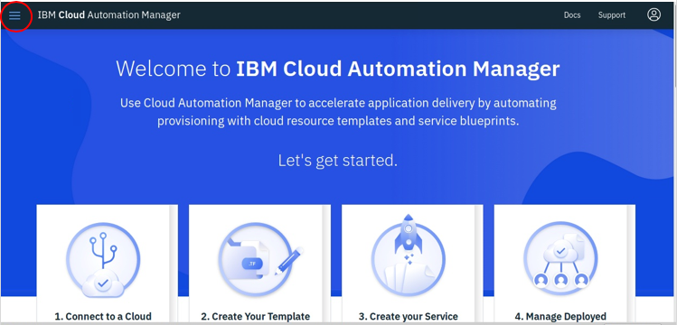
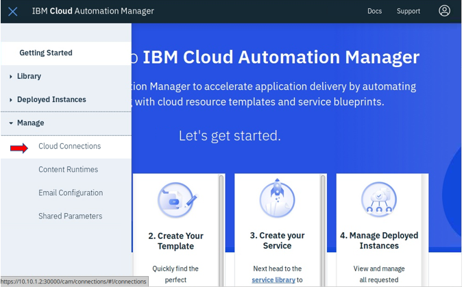
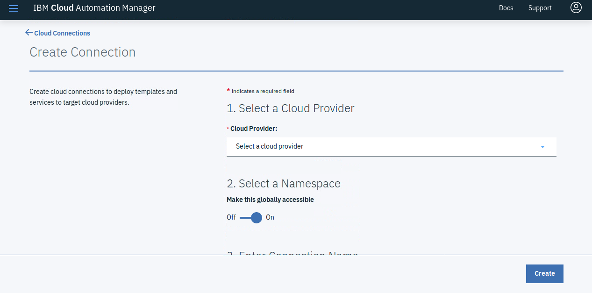
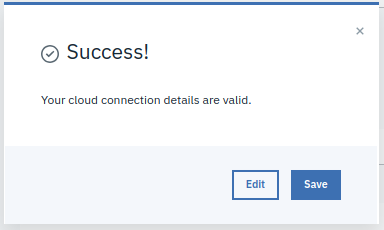

# CAM Configuration

In this lab you will go through the process of creating a CAM connection, testing it and then deploying a template.

### Create a Connection

1. Open the **boot** node and login as sysadmin (passw0rd)

2. Open a Chrome bowser window and log into ICP UI (admin/passw0rd)

   Use the ICP link in Chrome or enter [https://10.10.1.2:30000](https://10.10.1.2:8443)

3. From the ICP UI, open the menu icon 

   

   Then select **Manage** > **Cloud Connections**
   
   

4. Click **Create Connection**

5. You will then be presented with the Create connection page

    

6. In the Create Connection page, set the following:

    - Select a Cloud Provide: **VMware vSphere.** 
    - Select a Name Space: make this globally accessible - **On**
    - Enter a unuique  connection name:

         example: **_Team#\_VMware_**

    - Enter a Connection Description:

         example: **_Team# VMware connections_**

    - Configure Connection
      - vCenter User: **administrator@vsphere.local**
      - vCenter Password: **Passw0rd!**
      - vCenter Server:  **10.0.0.210**

7. Click **Create**
  
8. You should see a "Success" dialog when complete

   

### Test Connection

1. In the left-side navigation bar open the menu and select  **Manage** > **Cloud Connections**
2. In the connection list, click the menu in the **Status** column for the connection that you want to test.
3. In the action list, click **Test Connection**. If the connection is successful, a green check mark is displayed in the **Status** column for the connection.

-----------------------------------------------------------

