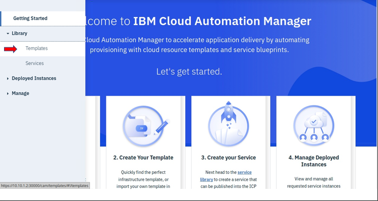
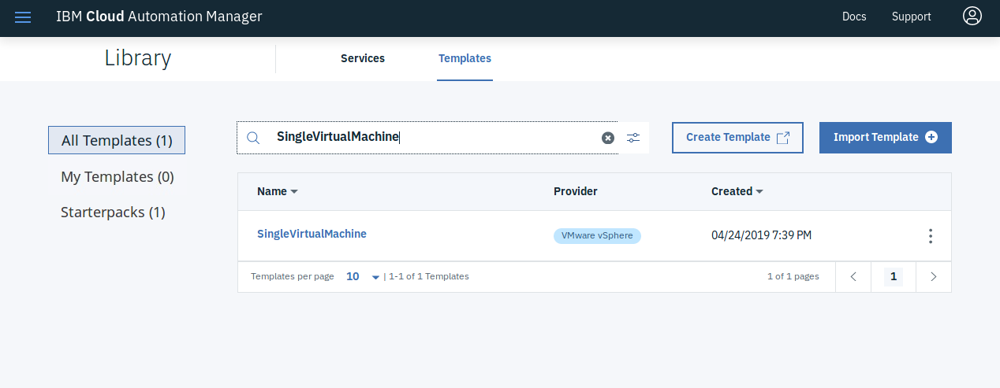
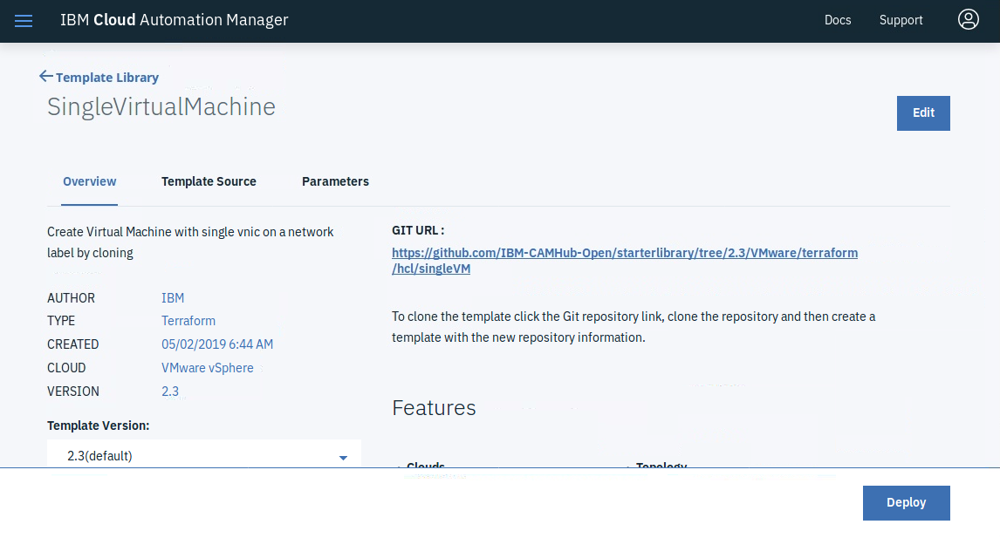
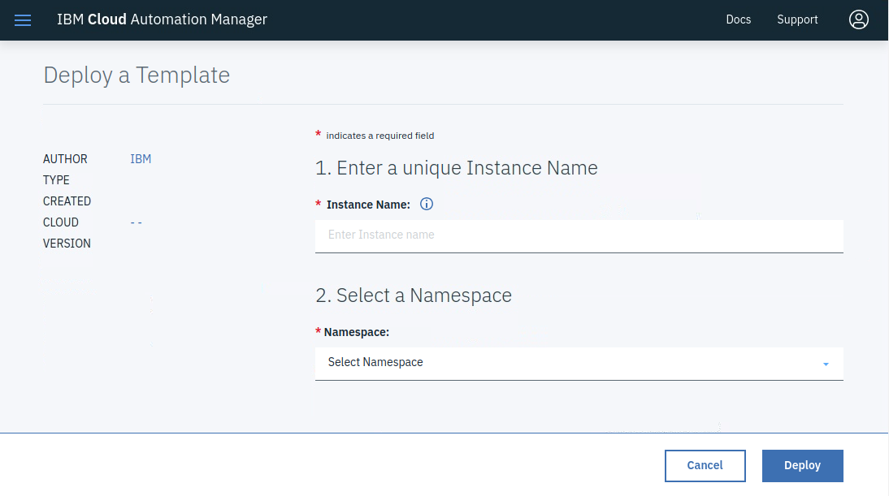
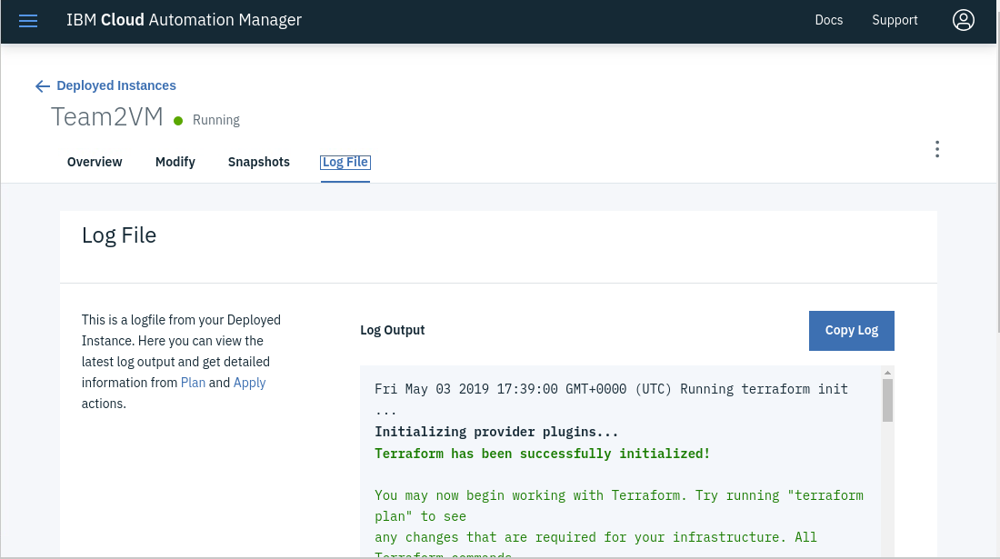
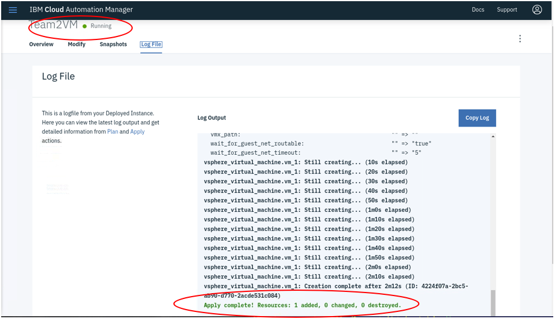

# Create a Template to Deploy a VM

In this lab you will create a Template and deploy a Virtual Machine from that template.

### Create a Template to create a VM

1. Open the **boot** node and login as sysadmin (passw0rd)

2. Open a Chrome bowser window and log into ICP UI (admin/passw0rd)

   Use the ICP link in Chrome or enter  [https://10.10.1.2:30000](https://10.10.1.2:8443)

3. In the left-side navigation bar open the menu and select **Library** > **Templates**. The template library is displayed.

   

4. In the search bar, search for **SingleVirtualMachine**

   

5. Select **SingleVirtualMachine**

   

6. Click **Deploy**

7. This will then bring up the Deploy a Template screen

   

8. Fill in the following parameters for this template.

   - Instance Name - **Team#VM**
   - Select a Namespace - **Services**
   - Select a Cloud Connection - **Select the Cloud Connection you created in the previous lab**

   - Cloud Input Variables
     - vSphere Cluster - Target vSphere cluster to host virtual machine: **DatacenterCluster**
     - vSphere Datacenter - Target vSphere Datacenter fro virtual machine creation: **Datacenter**
     - vSphere Folder Name - Target vSphere folder for virtual machine:  **Target/*Team#***

   - Virtual Machine Input Variables

     - Virtual Machine Hostname - Host Name of virtual machine:  **Team#-vm1**
  
       **Note:** Valid characters for hostnames are ASCII(7) letters from a to z, the digits from 0 to 9, and the hyphen (-).

     - DNS Servers - DNS servers for virtual, network adapter: Click **Add New**:  **8.8.8.8**

     - DNS Suffixes - Name resolution suffixes for the virtual network adapter: Click **Add New** :   **cam.local**

     - Domain Name - Domain Name of virtual machine:  **cam.local**

     - Operating System ID / Template - Operating System id / template that should be used when creating the virtual image:  **rhels76-template**

     - Root Disk Size - size of template disk volume:  **25**(default)

     - Template Disk Controller - type of template dick controller: Select **SCSI**. (default)

     - Template Disk Datastore - data store cluster name from target virtual machine's disks 
       - Odd team #'s use **D_S01_L01_500G**
       - Even team #'s use **D_S02_L01_500G**

     - Template Disk Type - type of template disk volume: Select **Thin Provision**

     - Virtual Machine Gateway IP address: **10.0.0.1**

     - Virtual Machine IP address: Select an IP from the range assigned to your team found here: [Team Assignments](https://github.ibm.com/john-webb/cam4admins/blob/master/Team_Assignments.md)

     - Virtual Machine Memory - memory assigned to the virtual machine: **1024**

     - Virtual Machine Netmask Prefix:  **24**

     - Virtual Machine vCPU's: **1**

     - Virtual Machine vSphere Port Group: **VM Network**

     - vSphere Network Adapter Type: Select **vmxnet3**

     - vSphere Resources Pool - Target vSphere Resource Pool to host the virtual machine:  **CAMPool**

9. Click **Deploy**

10. During the deployment you can monitor the log file
   
    

11. Upon a successful deployment you will see the following:
   
    
    
    Notice the APPLY Complete at the bottom of the log file and the Green Dot with "running" next to it,  this indicates that your VM was successfully deployed.

