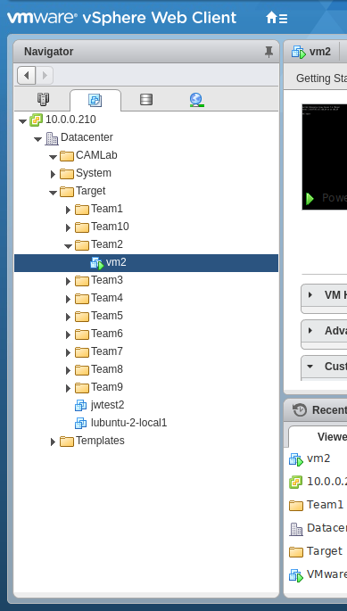
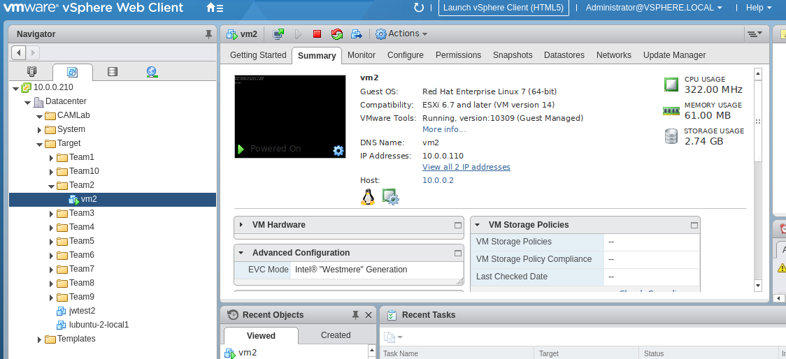
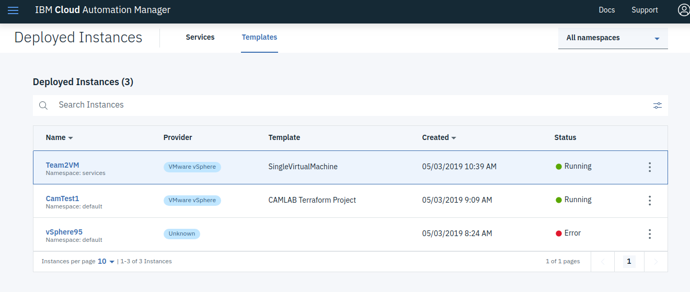
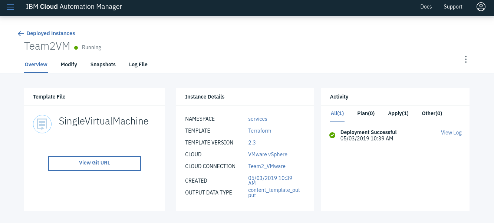
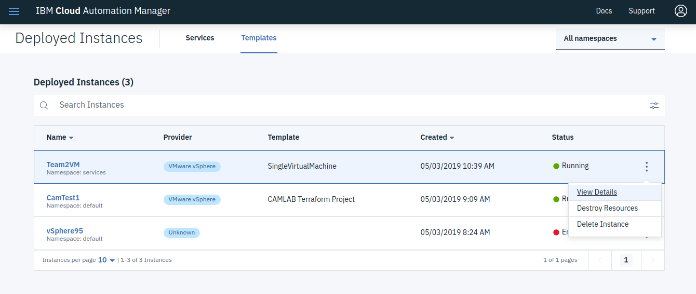
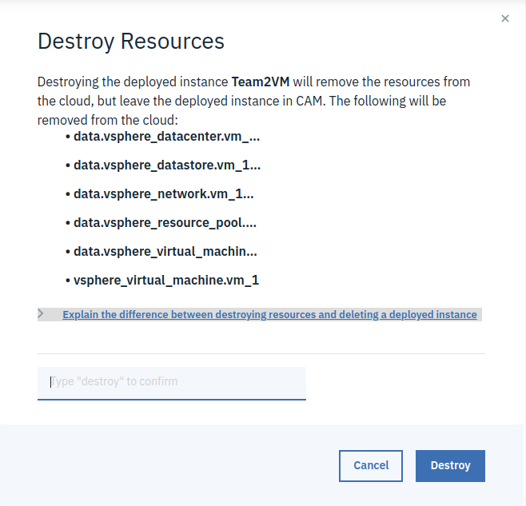

# CAM and vSphere User Interfaces

### Review VM in vSphere

1. Open the Chrome browser and login to vCenter using the URL and credentials below (also in the bookmark bar): 

   **Note:** If prompted Select **LAUNCH VSPHERE WEB CLIENT (FLEX)** 
   **Note:** On first login you may get a warning about Adobe Flash. Just click the Get Adobe Flash icon and allow Adobe flash to run in the browser

   - User: **administrator@vsphere.local**
   - Password: **Passw0rd!**
   - URL: https://10.0.0.210/vsphere-client/?csp

   
2. Open the **Navigator** tab (it can sometimes be minimized to the left side of the console), if it's not already open.  Go to the VM's and Templates tab in the navigator open *10.0.0.210* > *Datacenter* > *Target* > *Team#* > *Team#VM*

   

3. In the Panel to the right of the Navigator will be a view of the VM just created.

   

### Review UI for the deployed instance

1. Goto Deployed Instances > Templates.  here you will see the VM instance you created.  It should be up and running

2. Then Under Deployed Instances > Templates, select the Instance you just finished creating 

   **Team#VM**

   

3. Once selected you will be presented with the Deployed Instance Template User interface.  There are a number of things you can do from  this screen.

   

4. Once selected you will be presented with the Deployed Instance Template User interface.  There are a number of things you can do from  this screen.

5. In the upper let hand side, you will notice 4 main tab's 

   Overview, Modify, Snapshots and Log File

   - **Overview:**

     In this tab you can see the Template Name, Instance Details and Activity.  you can also see the 	  Resource Details.

   - **Modify:**

     In this tab you modify the current template and apply those changes.

   - **Snapshots:**

     In this Tab you can capture and revert to different states  of a Virtual Machine.

   - **Log File:**

     In this tab you can review the log file from the create, plan and  deploy of the templates.  If there are any 	errors, you can expand those and review the issues

### Cleaning up

1. Go back to the Deployed Instances > Templates, on the right band side of your instance, select the 3 dot's icon and you will then see 3 options

   *View Details*, *Destroy Resources* and *Delete Instance*

   

2. The View Details option will bring you to the opening page of your VM.

3. To Clean up your instance you will use the *Destroy Resources* and the *Delete Instance*.  They are executed in the following order

   1) Destroy Resource

   2) Delete Instance

4. Select **Destroy Resource**.  This will bring up a dialog box and you will have to type "destroy" into the highlighted input box and then Click **Destroy**

   

5. Select **Delete Instance**. This will bring up a dialog box and you will have to type "delete" into the highlighted input box and then Click **Delete**

   

