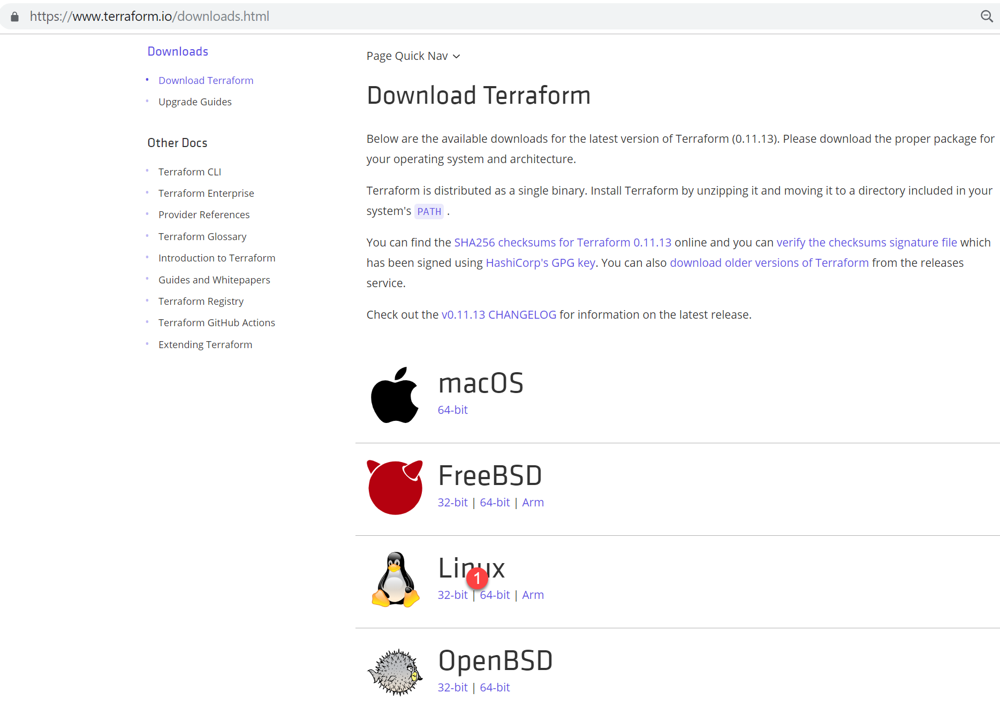

# Terraform Install

In this section we will install the Terraform binary, which will be used in subsequent labs. 

Execute all the following from the **Boot** node.

1. Launch the web browser and load the following URL

   <https://www.terraform.io/> 
   
2. On the web page, click on the **Download x.xx.xx** button, which will bring up a screen similar to this ...

   

3. Then click the link "download order versions of terraform" and select the terraform version aligned with CAM. For CAM 3.1.2 it should be terraform_0.11.11 and the binary **terraform_0.11.11_linux_amd64.zip** (right-click and select Save link as...)

   Direct link: [Terraform 0.11.11](https://releases.hashicorp.com/terraform/0.11.11/terraform_0.11.11_linux_amd64.zip)
   
   Save the binary to the ~/Downloads directory

4. Open a terminal and change to the Downloads directory

   ```
   cd ~/Downloads
   ```
   
5. Extract the terraform binary

   ```
   unzip terraform_0.11.11_linux_amd64.zip
   ```

6. You should now have the original zip file and a binary called **terraform**. This needs to be moved to a folder which is in the users path. Do this by running 

   ```
   sudo mv terraform /usr/local/bin/
   ```

7. Check that terraform is installed correctly by running the following

    ```
    terraform -version
    ```

8. Remove the downloaded zip file

    ```
    rm terraform_0.11.11_linux_amd64.zip
    ```
