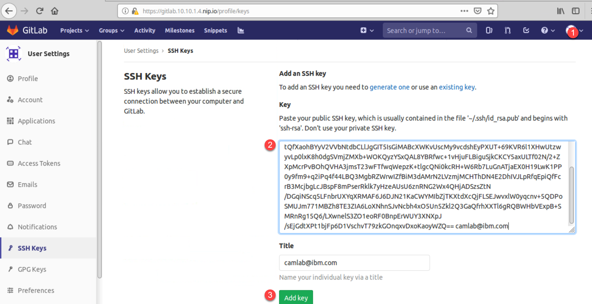
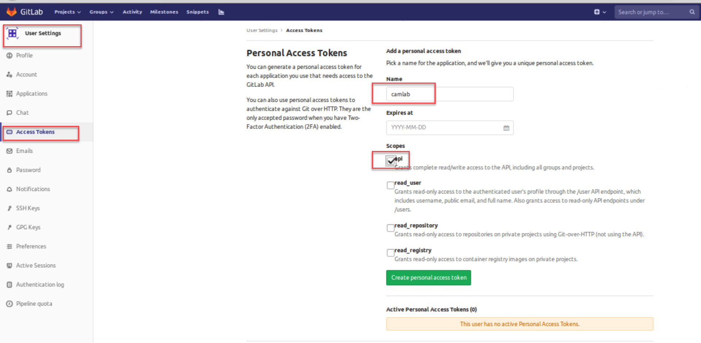
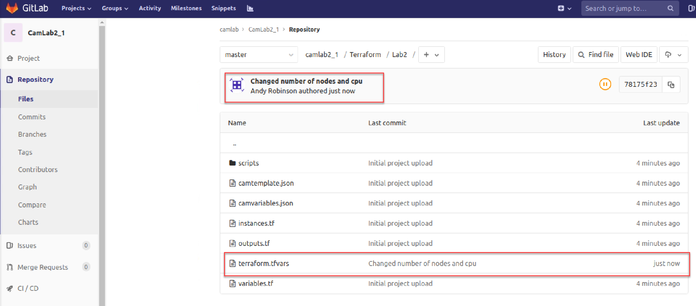

# Terraform Push Code to Git

### Create a GitLab user and add your ssh key 

In this section we will create an ssh key that will enable your user to push and pull information to / from the Git repository. 

Execute all the following from the **Boot** node.

1. Launch the terminal emulator that can be found on the desktop 

2. Run the following commands to create a new ssh key

   ```
   ssh-keygen -t rsa -b 4096 -C "studentXX@ibm.com"
         <accept all defaults>
   eval $(ssh-agent -s)
   ssh-add ~/.ssh/id_rsa
   cat ~/.ssh/id_rsa.pub
   ```

   NOTE: Copy the resulting output from the last command into the clipboard for later use

3. Launch the GitLab UI from Boot Node via Web browser 

   <https://gitlab.10.10.1.4.nip.io/>

4. Login in using **labadmin** with password **passw0rd**

5. Once logged in, click on the user icon (top right – number 1 in screen shot below) and select **Settings** from dropdown and select the **SSH Keys** option from the left sidebar.

6. Paste the string that was copied into the dashboard in the action of step 2 above into the **Key** section

7. Click the **Add** button


 
### Add a Personal Access Token
While still in the GitLab UI, you need to add a personal access token that will be used in a later lab.

1. Select **Access Tokens** from the left hand sidebar

2. Give it a name e.g. **camlab**

3. Check mark the **api** scope

4. Click on the **Create personal access token**

5. **Your New Personal Access Token** is created. Important - Record this for future use. 



### Create a New Project

1. Click on Project -> Your Projects and then click on **New Project** button

2. In the Blank Project tab, name the project **teamX-project1** (where X is your allocated student / team number)

3. Enter an optional description

4. Ensure the Visibility level is set to **Public**

5. Click **Create project**

   You now have your very first Git project (albeit it an empty one). 


### Cloning your project to the Boot node

1. From the terminal emulator previously opened, run the following commands

   ```
   cd ~/Documents/cam-admin-bootcamp
   ```

2. Now you are going to reassociate the local repo (cloned from the previous lab) to your new GitLabs project. Do this by executing these instructions ...

   ```
   git config --global user.email "labadmin@ibm.com"
   git config --global user.name "labadmin"
   rm -rf .git
   git init
   git remote add origin ssh://git@gitlab.10.10.1.4.nip.io:2222/labadmin/teamx-project1.git
      <Remember to swap the 'x' for your team number>
   git add .
   git commit -m "Initial commit"
   git push -u origin master
   ```

   Go back to the GitLab web UI and click on Projects -> Your projects. You should now see the project you created previously, but this time, when you click on the project name, it should have a folder called Terraform/Lab2. Click on the foler name and you will see the terraform files are now loaded into your project.
   
### Modifying your project

   There are two ways that you could update the content of your project. One is to use the GitLab browser, identify one of the files in your project and **Edit**.

   The second and the 'better' approach, is to edit the files that you pulled from the repository and are now residing on the Boot node.
   
   The following describes the steps to change the number of nodes and amount of CPU the plan requires.

1. From the terminal emulator previously opened, run the following commands

   ```
   cd ~/Documents/cam-admin-bootcamp/Terraform/Lab2
   vi terraform.tfvars
   ```
2. Search for the line containing **nodes = "1"** and change the '1' to a '2'

3. Search for the line containing **vcpu = "2"** and change the '2' to a '4'

4. Save the changes using **:wq!**

5. Push your changes back into the Git project using 

   ```
   git add terraform.tfvars
   git commit -m "Changed number of nodes and cpu"
   git push
   ```
6. Confirm the changes have been ‘pushed’ up to Git via the web browser by refreshing your Project page, where you should now see an updated 'Last commit' status against the terraform.tfvars files. You can also click on the file to see that the contents have been changed.



