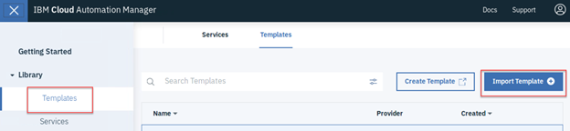
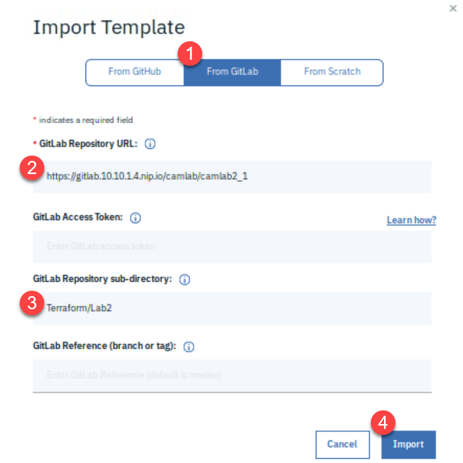
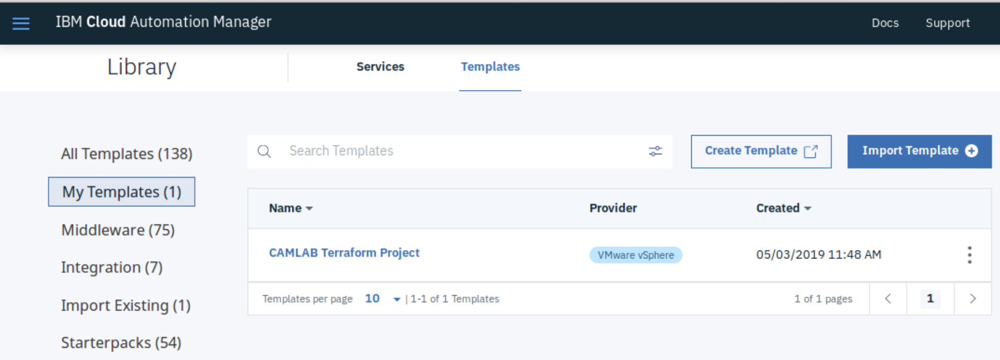
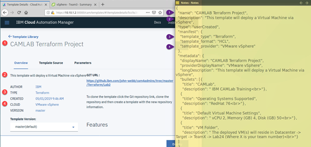
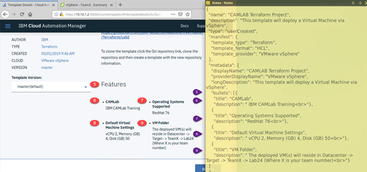
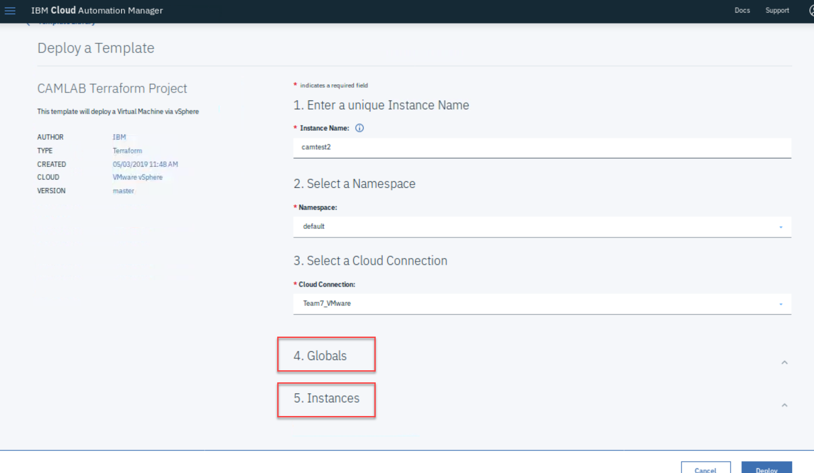
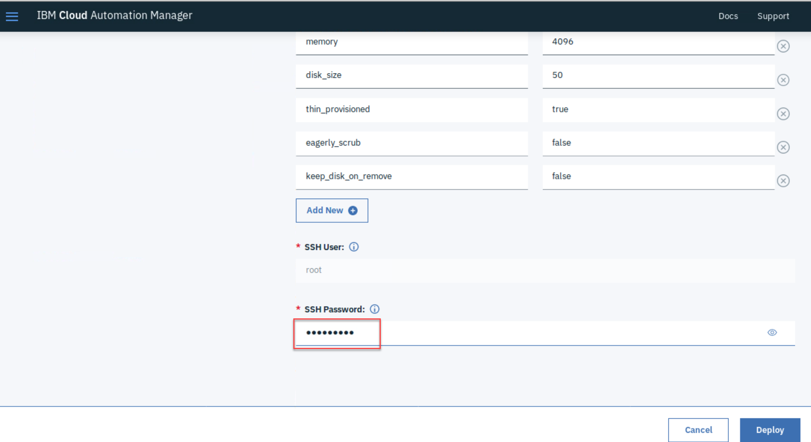

# Create CAM Template

This Lab will walk you through the steps to create a CAM Template from the working Terraform plan you uploaded to Git.

## Importing the Plan

1. Launch the IBM Cloud Automation Manager web interface using 

   ​	https://10.10.1.2:30000

   ​	Credentials admin / passw0rd

2. Click on the (hamburger) Menu -> Library -> templates

3. Click on the **Import Template** button

4. Choose GitLab as the source and enter the URL to the project you created in the previous Lab (should be something like https://gitlab.10.10.1.4.nip.io/labadmin/teamx-project1). Enter **Terraform/Lab2** into the sub directory field and the click on the **Import** button.

   

5. A summary screen is displayed. Make sure that the information relates to the project you created in the last Lab and hit **Save**
  
6. If you go back to Menu -> Library -> Templates, you should now see your imported template in **My Templates**

   

## Looking deeper into the Template

Now that we have a Terraform Plan imported into a CAM Template, let's look at what components it uses to help drive the user experience as well as how it integrates with the actual Terraform code.

There are two files that define how and what is presented to the user and the default values it will use when it is executed.

### Template Overview - camtemplate.json

The `camtemplate.json` file contains template metadata. It defines the function and features of the template.

In the Cloud Automation Manager user interface, the template **Overview** page includes the details defined in this JSON file.

### Template Variables - camvariables.json

The `camvariables.json` file contains metadata that is used in Cloud Automation Manager to augment the support for variables in terraform. Metadata adds additional parameters for existing variables that are understood and handled by Cloud Automation Manager.

When you deploy the template in the Cloud Automation Manager user interface, all these defined variables are displayed. After you enter the values in the user interface, they are passed on to a JSON file which is in turn sent for execution to terraform. Terraform matches these parameters with the variables in the `.tf` file, and therefore the name and type need to be consistent across both files.

This file is used to determine name-value pairs that the Terraform Plan will use when it is executed. It also configures how the parameters will be presented to the user. Attributes such as whether it will be read-only, completely hidden, or displayed but the value will be restricted (e.g. for passwords).

In addition, similar parameters can be **grouped** together so that they appear on screen together. For instance if you have a number of parameters that are related to connection to a database they could be presented in a grouped section, while information pertaining to the virtual machines that are being deployed could be in a separate group.

As can be seen in your project, there are two groups, one called **Global**, the other **Instances**. 

The Global parameters help determine the VMware information where the virtual machines will be created e.g. which Datacenter, Pool, Network, the image template to use, etc.  Many of these parameters are read-only (configured by setting the **immutable** attribute to **true** ) to ensure they are not inadvertently changed during the deployment.

The Instances section describe the virtual machines themselves, e.g. the name, number of nodes, number of cpus, etc.

Special parameters of note that are defined in your project are as follows ....

##### Team Number

	{
	  "name": "team_number",
	  "label": "Team Number",
	  "description": "Please enter your Team Number",
	  "type": "string",
	  "required": true,
	  "hidden": false,
	  "immutable": false,
	  "immutable_after_create": true,
	  "secured": false,
	  "group_name": "Globals"
	}
As you can see there is no "default" attribute. This is so that it will force you to enter one. Even if you hit the Deploy button it will not proceed as it is a 'required' parameter.

Also, the "immutable_after_create" means that once an instance has been deployed, if it is modified, it will retain the value used during the initial deployment and cannot be altered. 

This is a very important parameter for this plan, as it is used to determine the name of the virtual machines, the folder in which they will reside in vCenter, as well as the IPs they will be allocated. This will be explained in more detail in the next lab (2-5 Deploy CAM Template and Modify).

##### Camlab

      "name": "camlab",
      "label": "Camlab",
      "description": "Virtual Machine Resources",
      "type": "map",
      "default": {
        "nodes": "1",
        "vcpu": "2",
        "memory": "4096",
        "disk_size": "50",
        "thin_provisioned": "true",
        "eagerly_scrub": "false",
        "keep_disk_on_remove": "false"
      },
      "required": true,
      "hidden": false,
      "immutable": false,
      "secured": false,
      "group_name": "Instances"
    }
This is a variable with a 'complex' (map) datatype, which means it contains multiple name-value pair attributes e.g the number of nodes, virtual cpus, disk size, etc. and is used to determine the specific configuration of a deployed virtual machine. Each of these parameters is presented to the user and because it is not immutable, can be edited prior to deploying.

##### SSH Password

      {
        "name": "ssh_password",
        "label": "SSH Password",
        "description": "Password which terraform will use to connect to newly created VMs during provisioning",
        "type": "string",
        "required": true,
        "hidden": false,
        "immutable": false,
        "secured": true,
        "group_name": "Instances"
      }
As to be expected, there is no 'default' for this password parameter, and therefore the user is expected to enter one. The problem is we do not want the entered value to be visible while it is being typed. To negate this problem, we set the **secured** attribute to **true**, which results in asterisks being displayed as the user types in the value (see screen shot below).

## Useful References

A comprehensive explanation of the structures and supported datatypes can be found here 

<https://www.ibm.com/support/knowledgecenter/en/SS2L37_3.1.2.0/cam_struct_template.html>

