# Deploy CAM Template and Modify

This Lab will walk you through the steps to deploy the CAM Template created in the previous lab.

## Deploying the Template

1. Launch the IBM Cloud Automation Manager web interface using 

   ​	https://10.10.1.2:30000

   ​	Credentials: admin / passw0rd

2. Click on the (hamburger) Menu -> Library -> templates

3. Find the template created in the previous lab under **My Templates**. Click on the options menu (3 vertical dots on the righthand side of the template), and choose **Deploy**

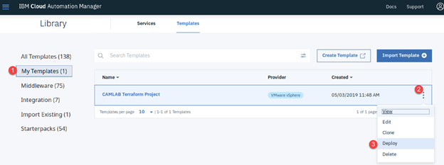


4. Next, the overview page is displayed. Review it and then hit the **Deploy** button when you are happy you have launched the correct template.

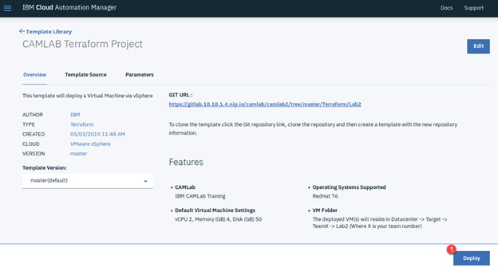

5. The following screen prompts for an **Instance Name** and a **Namespace**. These are required by all CAM deployments.

   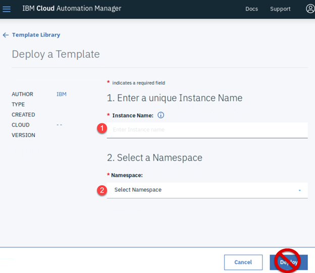

   For **Instance Name**, enter **TeamX_Instance** (where X is your team number).

   For **Namespace**, use the dropdown menu and select **default**.

   **NOTE !!!! Do not hit the Deploy button yet !!!!**

   On entering the Namespace, additional variables are displayed. These are all the variables defined in the camvariables.json file, grouped into their relevant groups (Global or Instances).

   In addition, there will a **Cloud Connection** variable which is a dropdown selection box. Choose the one you previously created in the 1-2 Configure CAM lab.

   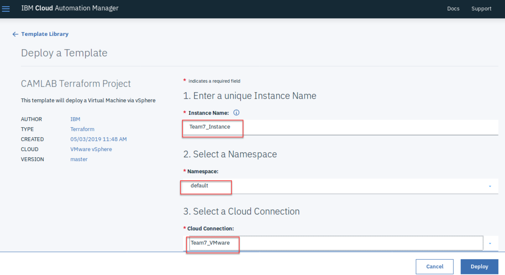


   The only other values that need to be entered now are the **Team Number**, which you should enter the number you have been allocated e.g. 7, and the **SSH Password**, which is **passw0rd**. Note as was descried in the previous lab, the password is not visible as you type.

   All other values are defaulted, and for now should be left unchanged.

6. Review all of the variables listed and then hit the **Deploy button**

   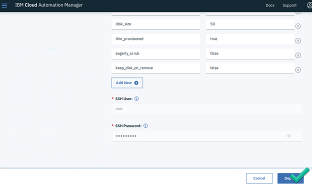

7. Once the deploy has started, the following deployment overview screen is displayed. You should see that your deployment is **In Progress**

   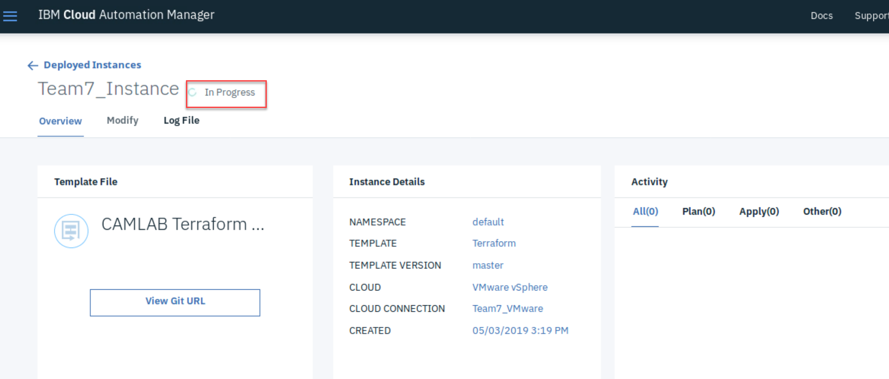

8. Now click on the **Log File** option and you can see the Terraform output as it occurs. This comes in very useful for troubleshooting issues.

   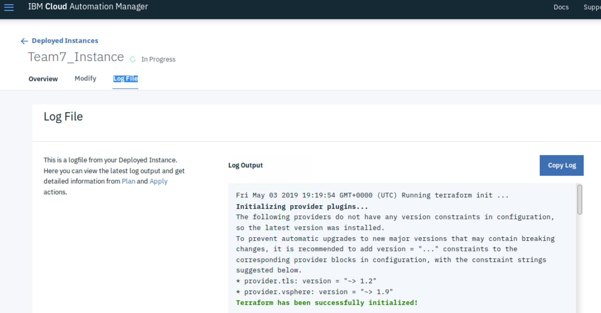

9. Eventually (hopefully), you will see the deployment status change to **Running** with a green light next to it. This indicates that the deployment was successful.

   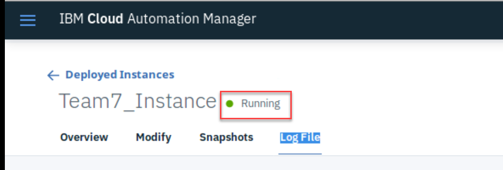

10. To validate that the deployment actually did something, click on the Overview option, and scroll down to the **Resource Details**. Here you should see one called vsphere_virtual_machine.camlab.

    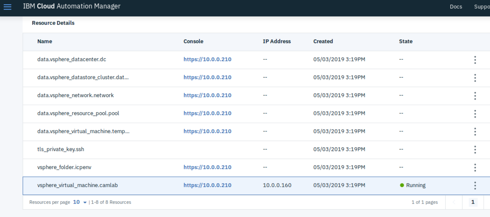

11. Click on the 3 dots to the right and choose Details. This will popup a window with information about the virtual machine, including its hostname and IP address.

    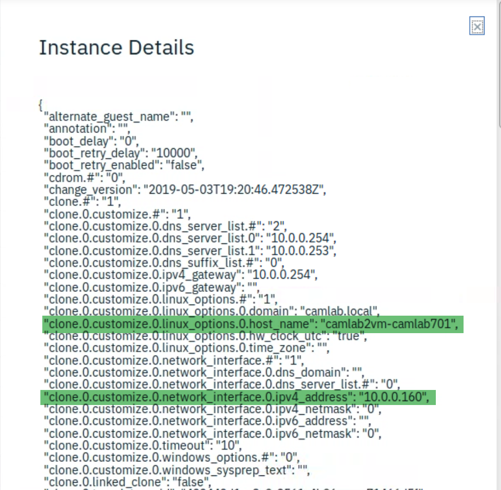

12. As a secondary validation, look in the vSphere Web UI and you should find the newly deployed virtual machine under the DataCenter -> Target -> TeamX -> Lab2

    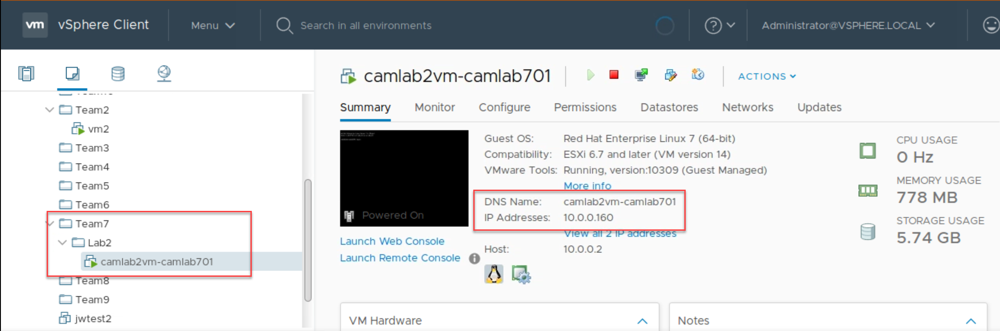

    

## Modifying the Instance

In this part of the lab you will modify the plan for the instance just deployed. 

NOTE: This does not affect the original CAM Template, therefore new deployments will still have the original variable configurations.

1. First, identify the instance you just deployed via Menu -> Deployed Instances -> Templates, and click on your instance (TeamX_Instance). This will bring up the overview screen previous seen.

2. Choose the **Modify** option at the top, which will display something similar to this. Do NOT change the template version master, just click **Next**

   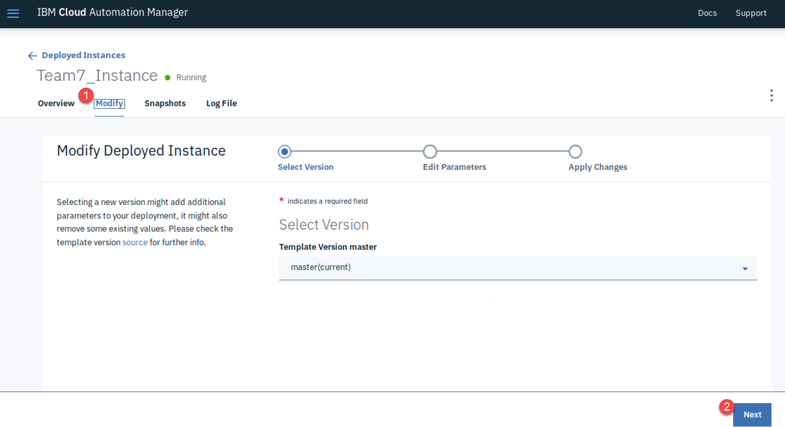

3. This will bring up the list of parameters that were used during the initial deployment. All of the values (with the exception of the Team Number) that could have been changed during the initial deployment can still be altered. 

   For this exercise we are going to change the number of nodes to 2 and the vcpu 4. 

   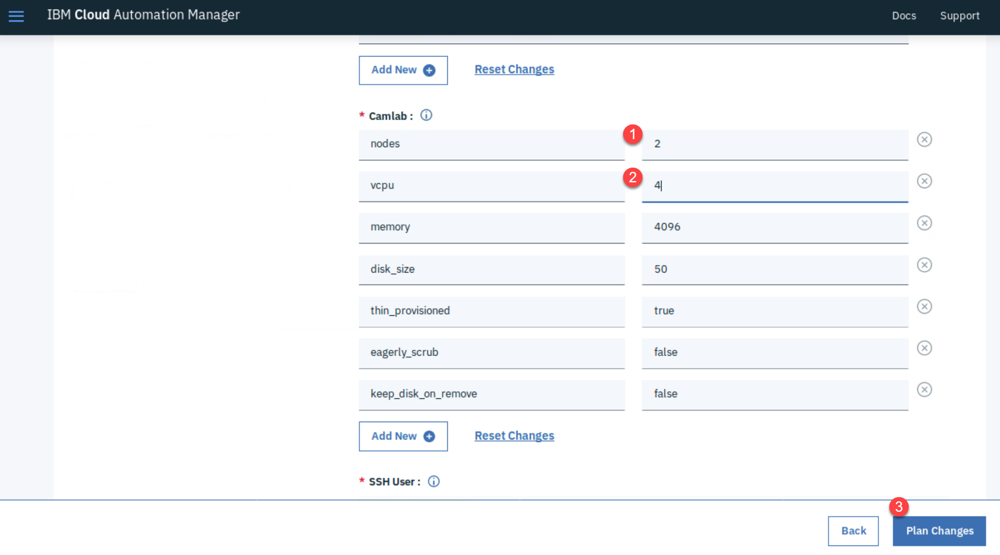

   Press the **Plan Changes** when ready.

4. This will execute a **terraform plan** i.e. it will only indicate what the changes will be. Scroll through the log and you should see that a second virtual machine will need to be created to fulfill the plan as well as changing the virtual CPU resource on the virtual machine that was initially deployed.

   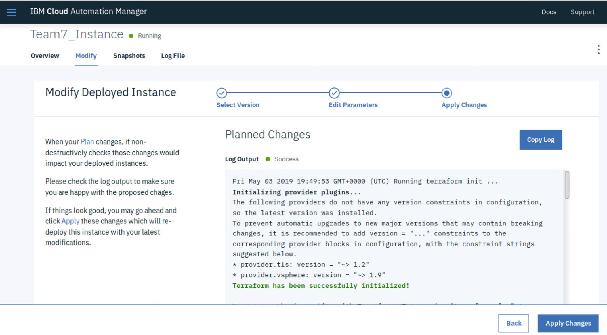

   The end of the log provides a summary of the changes that will be taken if applied.

   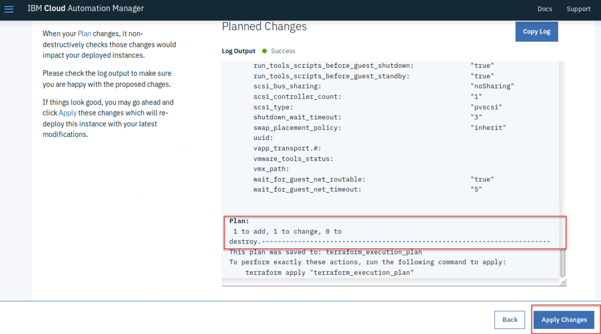

   Press the **Apply Changes** when ready, at which point it will prompt you to type 'apply' to prove you really want to do it.

5. Once the plan has been successfully applied, you will see the activities reflected in the Overview screen. 

   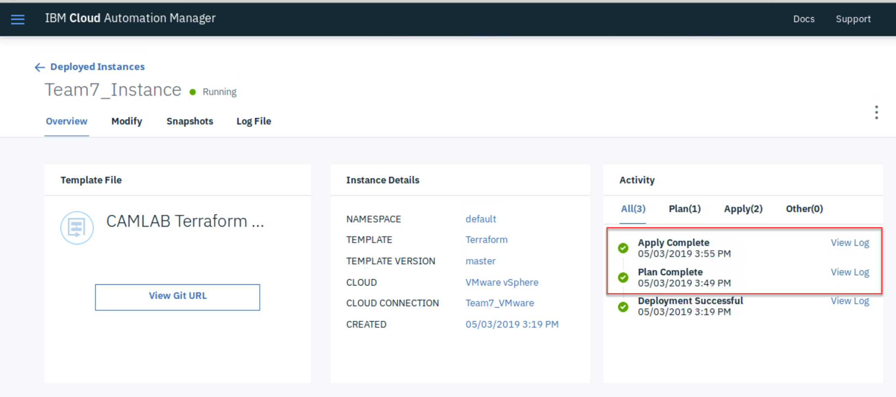

   Scroll down until you see the **Resource Details** section again and you will now see a second virtual machine.

   

   Again, clicking on the 3 dots to the right of it and select Details will give you all the information about that virtual machine, or you can look inside the vSphere Web UI. You will also note that both the new and the original virtual machine now have 4vCPUs.

   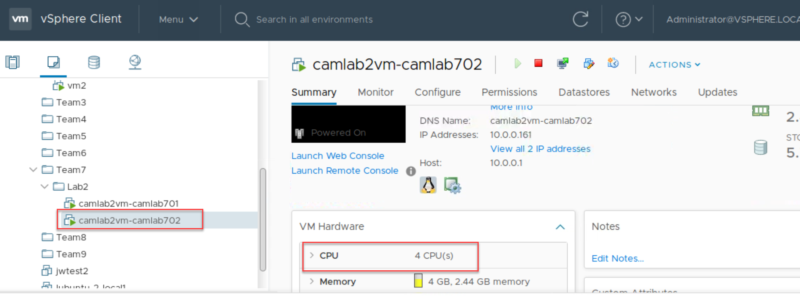

## Removing the Instance

Removing the instance is a two-step process. First it needs to remove the resources created in the Cloud (VMware), and then the actual instance reference needs to be removed from CAM.

To do this, carry out the following steps

1. Locate you instance created in the previous steps via the Menu -> Deployed Instances -> Templates, and click on the 3 dots to the right of it. Then select **Destroy Resources**.

   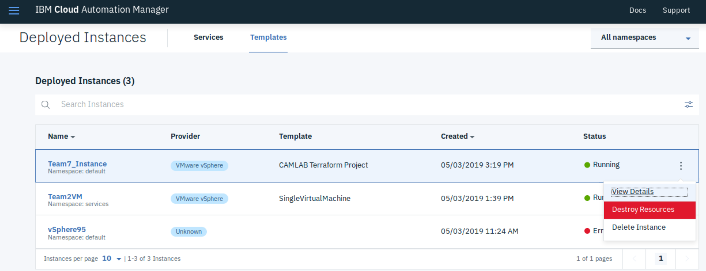

   This will display a list of actions it will carry out and prompt for validation to proceed - enter **destroy** and click the Destroy button.

   This effectively removes all the resources previously created in VMware for this instance, including the virtual machines, associated disks and the folder (Lab2) which was created to house them.

   Confirm this by trying to locate the virtual machines via the vSphere Web UI.

2. Once destroyed, click on the 3 dots again and this time choose the **Delete Instance** option. Again you will be prompt to confirm your action - enter **delete** and click on the Delete button.
3. The deployed instance will be removed from the list.

## Modifying the Template

Where in the earlier exercise to **Modify the Instance**, it only affected the individual instance, this exercise will update the actual CAM Template so that any future deployments will use the new values.

As this CAM template is linked with a Git Repository, any changes that are made to that repository will automatically be picked up during the next Instance Deployment.

To prove this, follow these steps ...

NOTE: All these steps will take place on the boot node

1. Launch the terminal emulator and change to the folder you previously created your cam project in during lab exercise **2-3 Terraform Push Code to Git**

   ```
   cd ~/~/Documents/cam-admin-bootcamp/Terraform
   ```

2. Edit the camvariables.json file with **vi Lab2/camvariables.json** and locate the line which contains "nodes". Change the number from "1" to "2". Also change the default instance name from "camlab2vm" to "newlab2vms". Save the changes with **:wq!**

3. Inform Git of the changes and push them to the repository

   Check that a file .gitignore exists which tells Git not to push terraform state and tfvars files:
   ```
   cat .gitignore
    
   #  Local .terraform directories
   **/.terraform/*

   # .tfstate files
   *.tfstate
   *.tfstate.*

   # .tfvars files
   *.tfvars
   ```
   
   then proceed ...
   ```
   git add Lab2/camvariables.json
   git commit -m "Changed vm host name"
   git push
   ```

4. Now repeat the steps taken above to **Deploy the Template** (see NOTE below). 

   NOTE: Pause just before hitting the **Deploy** button and examine the instance parameters, specifically the **Instance Name** and **nodes**

   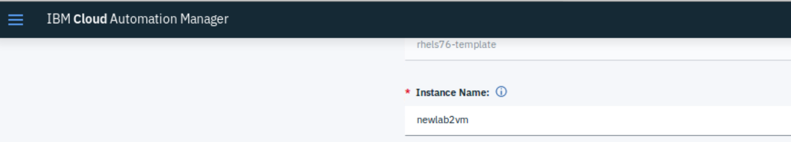

   
   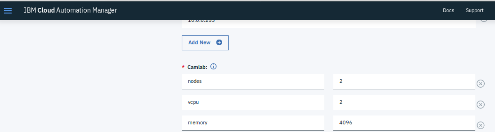

   You should see that the changes pushed to Git have automatically been pulled into the CAM template without any additional changes having been made to it.

   Deploy the instance and check that the newly named virtual machines reflect the new naming convention.

   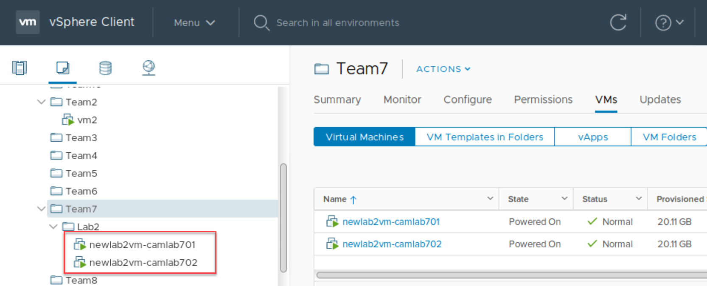
   
   
## Cleaning Up

Follow the **Removing the Instance** instructions above to remove the newly created instance.
