# Intro to CAM Template Designer

The lab will walk through populating an empty GitHub repository and publishing it to CAM as a template.

## Prerequisites

This lab assumes you already have a GitHub account.

First create yourself a new (empty) repository, ideally with a name which will be relevant to this lab e.g. CAMLab31_TD. 

Make sure that it is configured as **Public**.

Once created, record the URL displayed in the 'Quick setup'  for later use.

## Importing the Empty Repo

Launch the CAM UI via the browser tab provided on the Boot node desktop.

On the 'Welcome' page, scroll down to the 'Useful links' section and click on the **Template Designer** one.

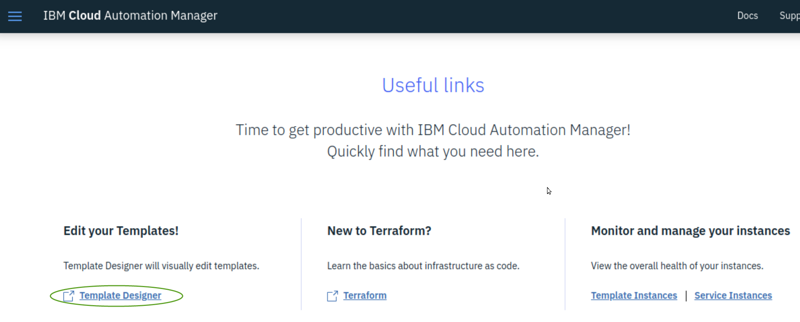

Once the template designer has loaded, click on the **Repositories** icon on the left which will present a screen similar to this ...

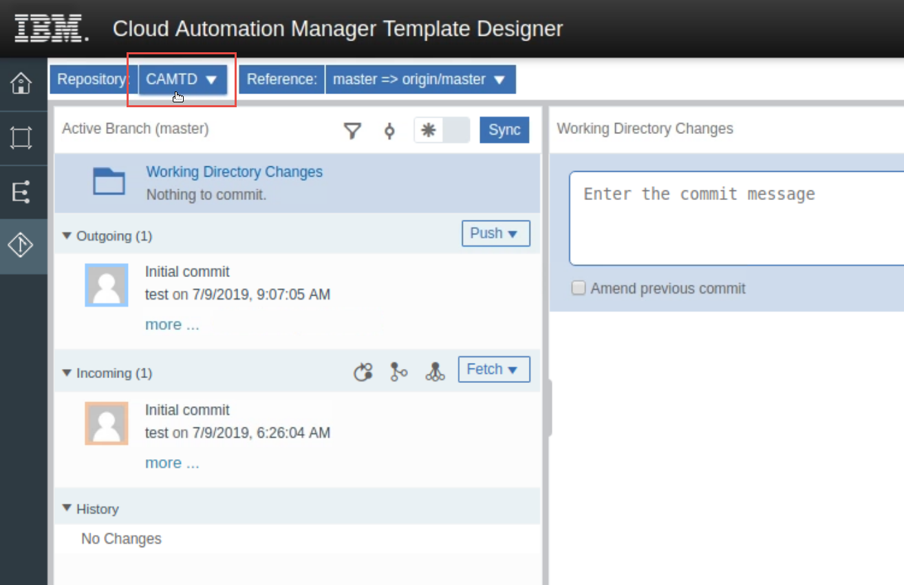

Next click on the drop down of repositories (CAMTD in the screen shot above), which will give you the option to change the current repository or to Clone / Init a repository.

Click on the **Clone Repository** button. This will present a popup for you to enter a Repository URL. This is where you copy in the one you recorded during the prerequisite steps.

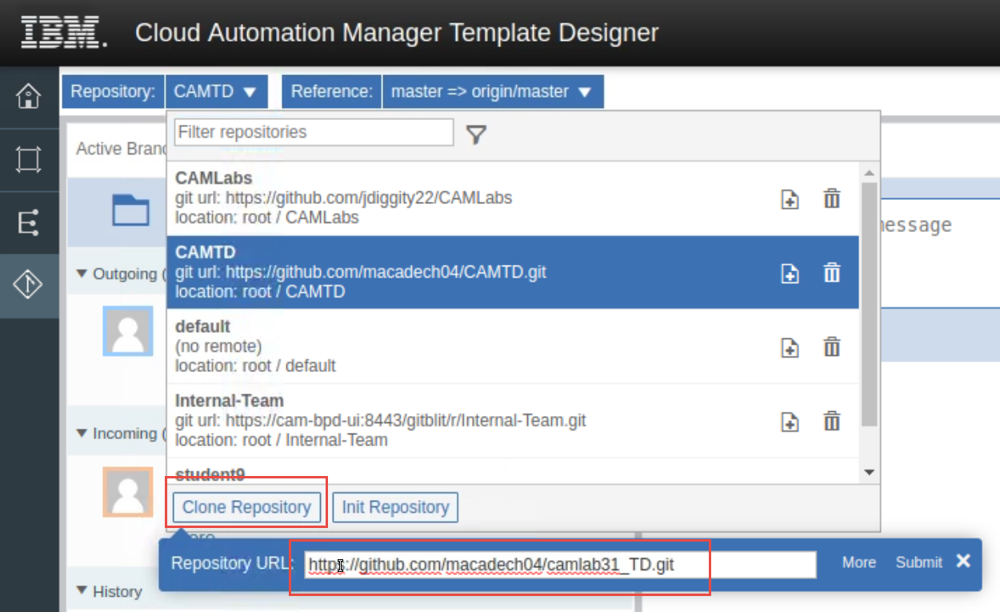

Next, click on the Submit button.

Your repository will be added to the list. You now need to click on it to make it the current one.
 
Click on the blue print designer icon.

As shown on the next screen click on the actions button (3 dots to the right of the repo name) for your repository and choose to create a new project ...

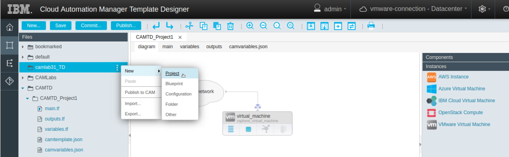

Ensure the 'Subtype' is set to CAM and give your project a name (note this is what the template will be called when it is published).

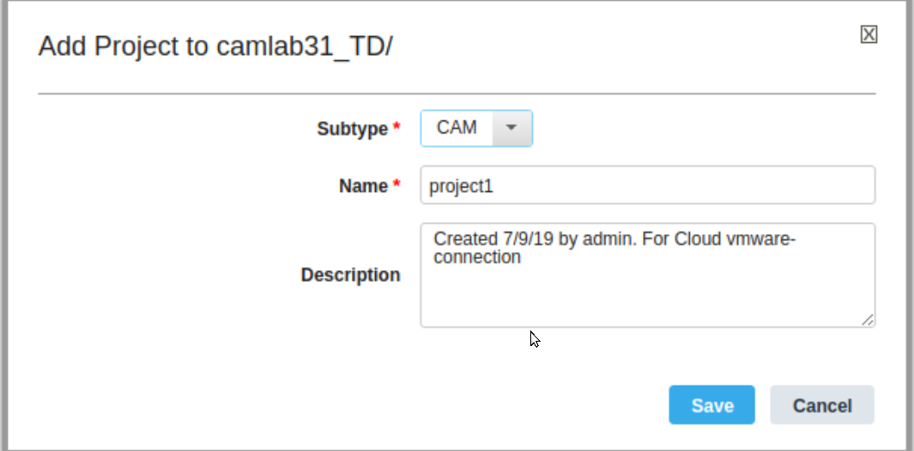

You should now see that 6 files have automatically been added to your project, namely main.tf, outputs.tf, variables.tf, camtemplate.json, ca,variables.json and README.md.

Now to store these new files back in the GitHub repository, click on the Repository button (step 1 below), select all the files (step 2), enter a comment for the commit (step 3) and finally submit the changes (step 4).

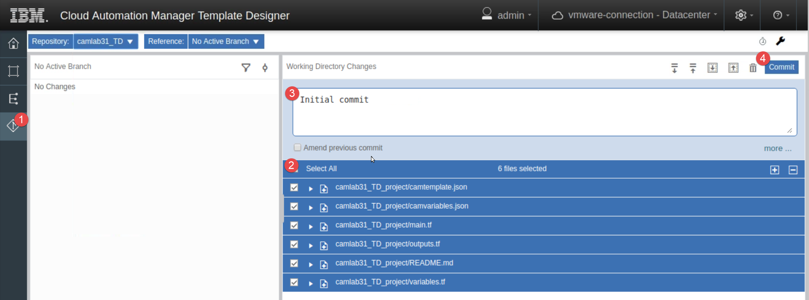

Additional commit information is requested, just enter a dummy name and email for the author and committer and hit the 'Commit' button again. 

Click on the **Push** button next to the 'Outgoing activity', which will prompt you for your GitHub user name and password.

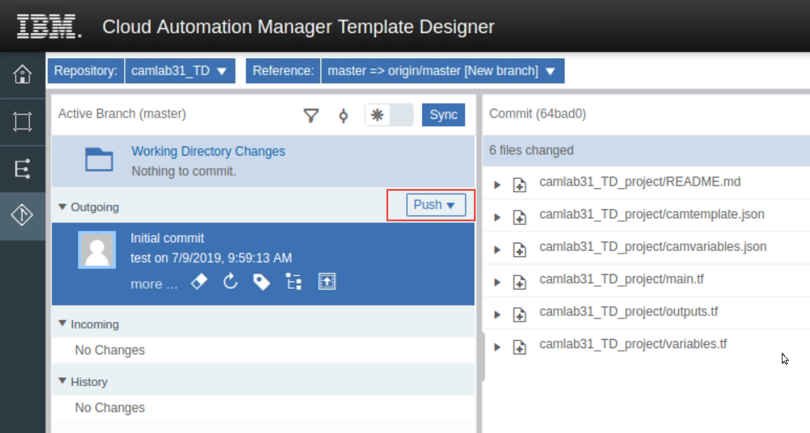

You should now see a new project and the 6 files populated in your GitHub repository.

## Adding an Object to the project

Now that you have a project created, you will add an instance to it. This is achieved by clicking on the **Blueprints** button on the left hand panel, and making sure that you focus is on the 'main.tf' file in the new project. Then drag the **VMware Virtual Machine** instance object from the right hand panel into the main design area.

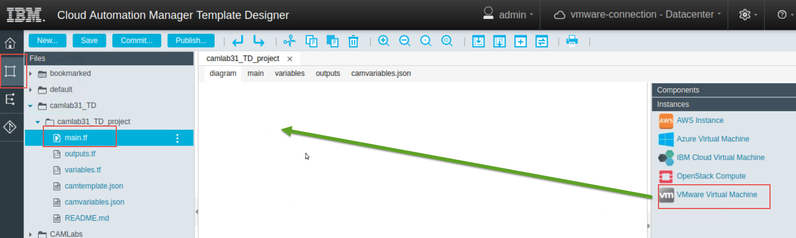

This will prompt for the virtual machine name (accept the default) and to add a resource pool (choose vSphere Resource Pool). After which you should have something like this ...

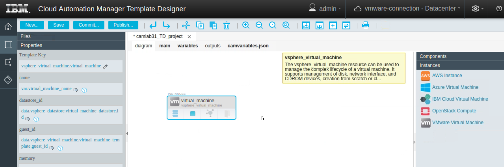

Next click on the 'Networks' tab in the right hand panel and drag the **VMware Reference Network** object into the main design area. A popup will be presented asking for a name, accept the default.

Next, click on the icon presenting the network (a cloud) in the main design area which will display an arrow on the right side of the cloud. Click on this arrow and drag it to the virtual machine icon. A new popup will be displayed for the name of the network, accept the default.

You should now see something like this ...

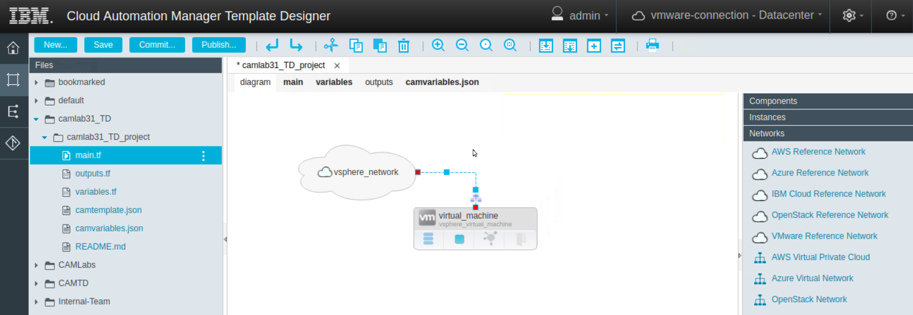

Click on the **Save** button at the top of the page.

Click on the **Commit** button at the top of the page to prepare the changes for your GitHub repository. Enter a description in popup that is presented and click on the new **Commit** button. This will probably display an issue indicating 'no files selected' and gives you an option to 'Always select change files (see Git Settings)'. Check the box and click 'OK' which will then list the files that have changed since the previous commit.

Select all the and press **Commit** again. 

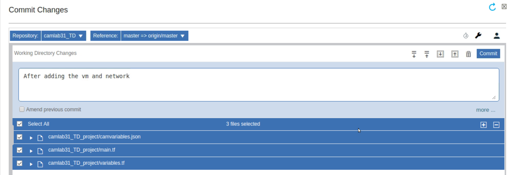

Close the popup window.

Click on the **Repositories** button in the right hand panel where you should see and outgoing activity. Click on the **Push** button and enter your GitHub credentials. On completion, you should be able to see the changes in your Github repo.

Finally to push this to CAM, click on the **Blueprints** button on the left hand side to bring up the design screen again and click on **Publish**. This presents a popup. Click on **Save**.

You should now be able to see your template created in the CAM UI under Menu -> Library -> Templates.

