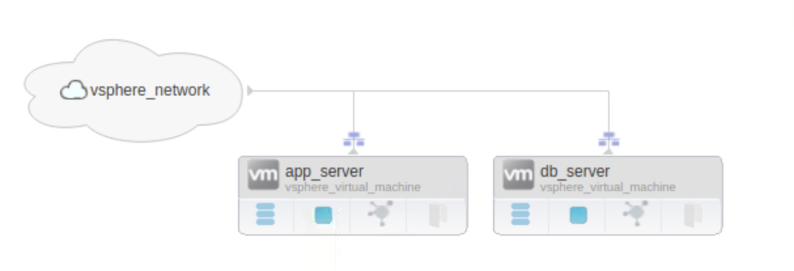
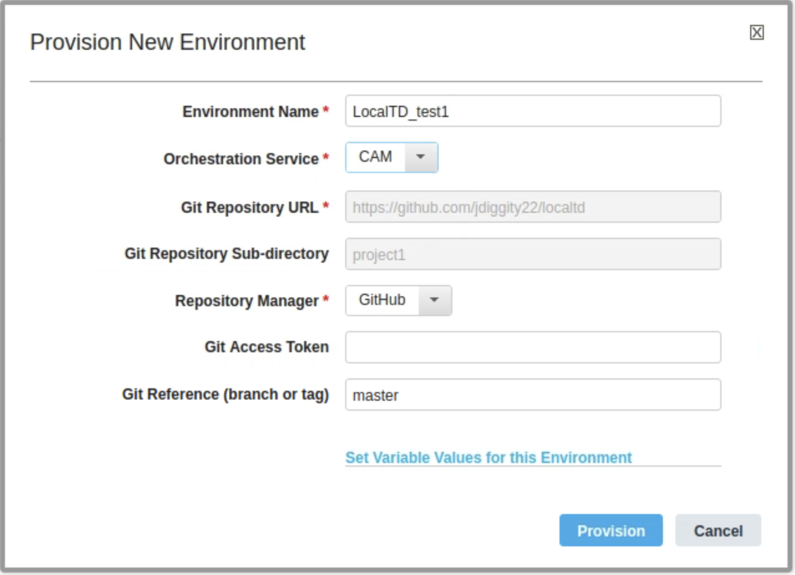
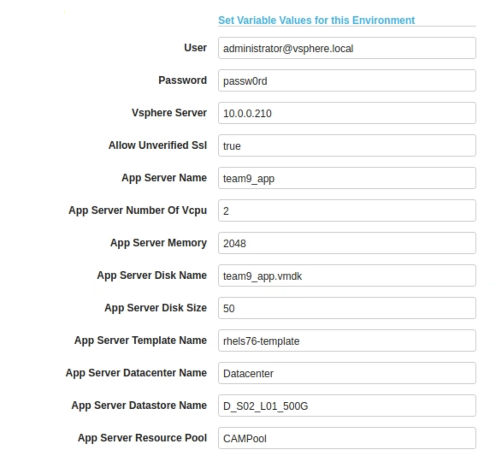
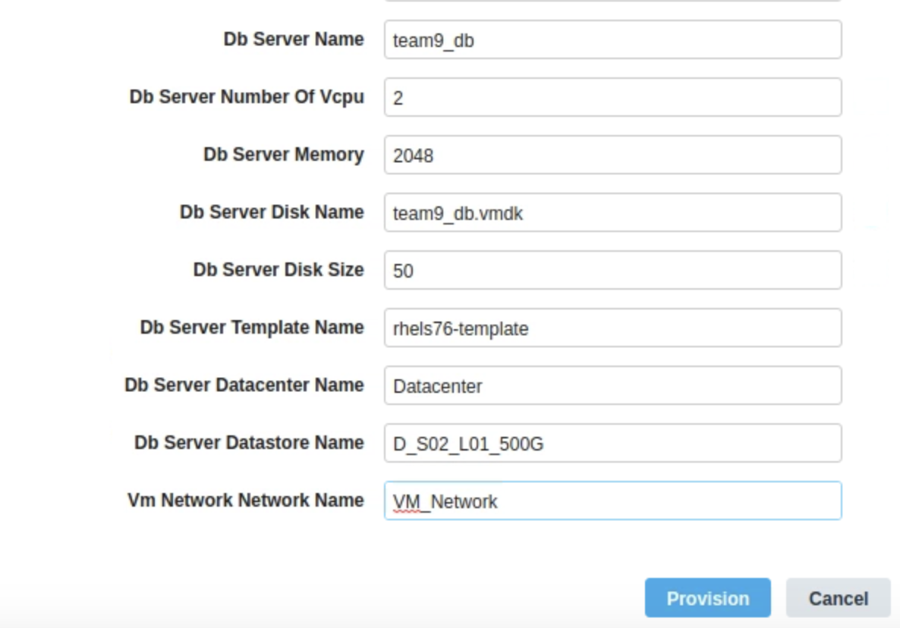

### Creating a deploying with the Local Template Designer

1. Create a new empty GitHub repository

2. Open the local Terraform Designer in Chrome at the URL below

   http://localhost:8080/landscaper/

3. Login to the template designer (ucdpadmin\ucdpadmin)

4. Navigate to the Git repository view in the Template Designer and clone the git repository that you just created

5. Navigate to the Blueprint view and create a new Project in your repository and click **Save**.

   Subtype: **CAM**

   Name: <enter a name for your project>

6. Drag and drop a "VMware Virtual Machine" onto the canvas set the values below and click **Ok**.

   Name: **app_server**

   Select: **VSphere Resource Pool**

7. Drag and drop another "VMware Virtual Machine" onto the canvas set the values below and click **Ok**.

   Name: **db_server**

   Select: **Reuse:  VSphere Resource Pool**

8. Add a "VMware Reference Network" to the canvas

   Name: **sphere_network**

9. Select the vsphere_network on the canvas and connect it to the virtual machines.

   **Hint:** Drag from the arrow icon

   Network Name: **vm_network**

10. Your canvas should now look like this. **Save** your project.

    

11. Navigate back the Git reposository view.

12. Commit and push your changes.

13. Navigate back to the Blueprint view and select your project

14. Select the main.tf file in your project and click the **Provision** button.

    Environment Name: **LocalTD_test1**

    

15. Select "**Set Variable Values for this Environment**"

   

   

   

16. Click **Provision**

17. Navigate to the **Environments** view to monitor your deployment.

   

   ### Continue to explore the Template designer

   Modify your settings and publish the service. What happens? 

   How do we version our templates?

   

