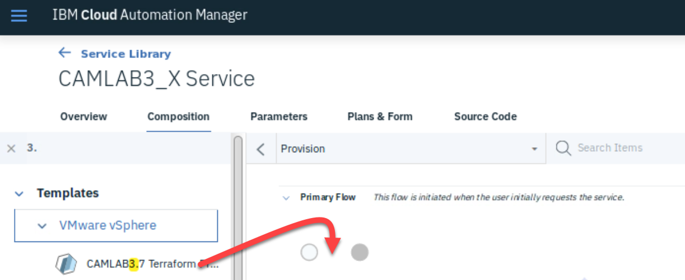
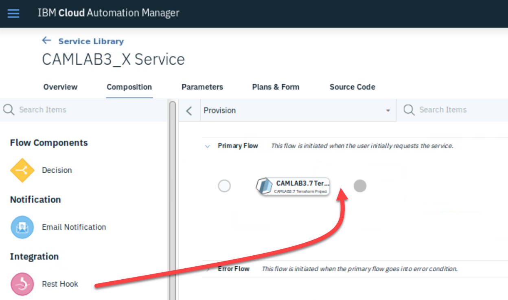
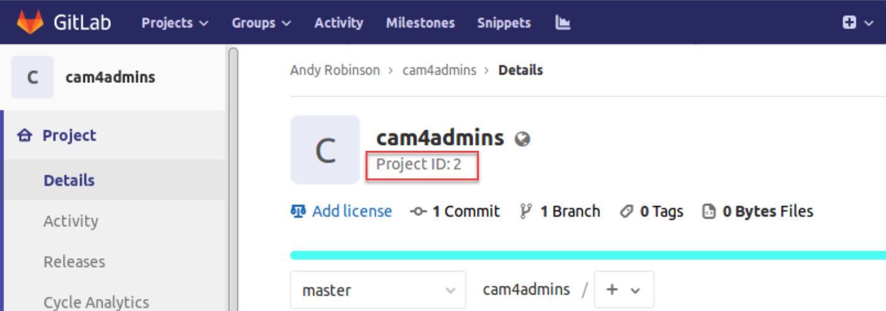
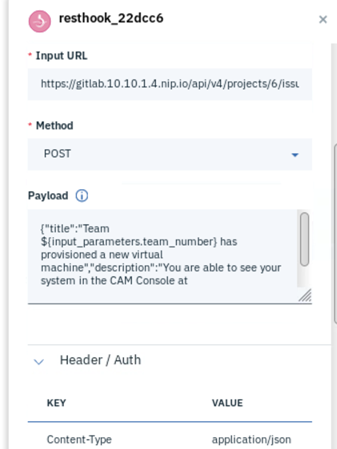
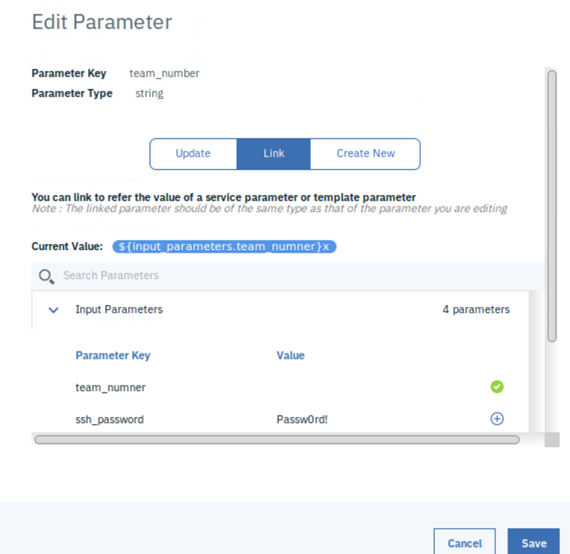
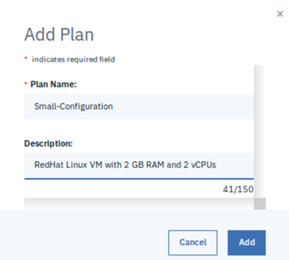
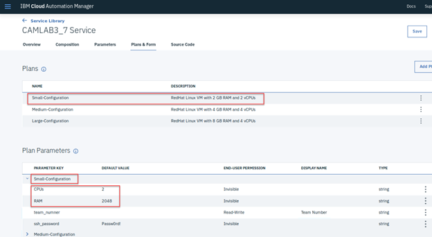
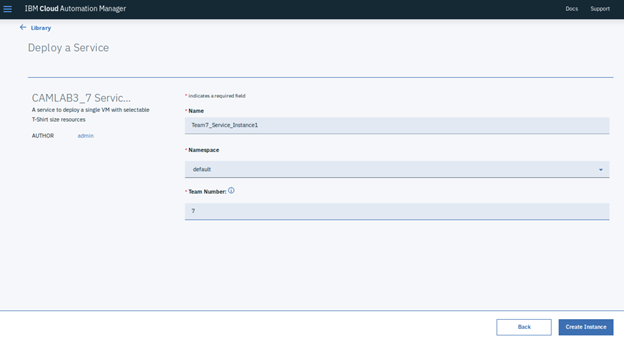

# Create CAM Service

This Lab will walk you through the steps to create a CAM Service which will deploy a single virtual machine with different resources based on T-Shirt size plans.

## Create a New Template

1. Create a new template following the steps from **2-4_CreateCAMTemplate** using

   GitLab Repository URL: **<https://gitlab.10.10.1.4.nip.io/labadmin/teamx-project1>**

   GitLab Repository sub-directory: **Terraform/Lab3**

   NOTE: Before Saving the template, make sure to change the Display Name to **CAMLAB3.X Terraform Project**, where ‘X’ is your team number.

## Create a New Service
Click on Menu -> Library -> Services

1. Create a new service 

   Display Name: **CAMLAB3_X Service**  (where X is your team number)

   Short Description: **A service to deploy a single VM with selectable T-Shirt size resources**

2. Click on the **Composition** tab

   In the left-hand **Search Items** box (1 below), type in 3.X (where X is your team number). This should find the template you imported in the first activity inside the VMware vSphere folder.

3. Drag the template between the two circles in the main **Primary Flow** section. 
   

4. In the right-hand information panel, you need to scroll down and provide the Cloud connection. Choose the one you created during Lab **1-2 Configure CAM**.

5. Clear out the text from the **Search Items** box you entered in step 3 above, which should then present you with a list of process activities e.g. Decision, Email, Rest Hook, etc.

6. Drag the **Rest Hook** into the process flow to the right of the template you added in step 3

   
   

7. In the right-hand information panel, fill in the following

   Input URL: **https://gitlab.10.10.1.4.nip.io/api/v4/projects/2/issues?private_token=<your_personal_access_token>**

   Method: **POST**

   Payload: 
   ```
   {
     "title": "Team ${input_parameters.team_number} has provisioned a new virtual machine",
     "description": "You are able to see your system in the CAM Console at https://10.10.1.2:30000/cam/portal/#!/serviceinstances"
   }
   ```
   
   **NOTE 1: Notice how you can embed variables (team_number) into the payload**

   **NOTE 2: The <your_personal_access_token> in the input URL is what you created during LAB2-3**

   **NOTE 3: The /2/ in the Input URL may differ as this is the project ID. To obtain this number, open your GitLab project and find the Project ID under the name**
   
   
     

8. In the same panel, expand the **Header / Auth** section, and add the following if it doesn't already exist

   Key: **Content-Type**

   Value: **application/json**

   You should end up with something like this ...

   

9. Click on **Save**

## Adding Parameters

1. Click on the **Parameters tab**

2. Add the following Input Parameters by clicking on the **Create Parameter button**

   ```
   Parameter Key:       team_number
   End-User Permission: Read-Write
   Parameter Type:      String
   Display Name:        Team Number
   Value Required:      Yes
   Default Value:       <empty>
      
   Parameter Key:       vm_number
   End-User Permission: Read-Write
   Parameter Type:      String
   Display Name:        VM Number
   Value Required:      Yes
   Default Value:       <empty>
   
   Parameter Key:       CPUs
   End-User Permission: Invisible
   Value:               1

   Parameter Key:       RAM
   End-User Permission: Invisible
   Value:               1024
   
   Parameter Key:       ssh_password
   End-User Permission: Invisible
   Value:               passw0rd
   ```
 
3. Now you need to **Link** the template parameters with the parameters just created. To do this expand the template under the **Activity Parameters** section and locate the Parameter Key team_number. 

   Click on the 3 dots to the right and choose **Edit**. Click on the **Link** tab and select the **team_number** Input Parameter created in the previous steps by clicking on + sign to the right.

   Finally click **Save.**

   

4. Repeat step 3 for the other parameters created, where **vm_number** links to **vm_number**, **ssh_password** links to **ssh_password**, **vcpu** links to **CPUs** and **memory** links to **RAM**.

 

## Creating Plans

1. Click on the **Plans & Form**

   By default, a **Standard** plan is automatically created.

2. Click on **Add Plan**

3. Enter a plan name of **Small-Configuration** and a description of **RedHat Linux VM with 2 GB RAM and 2 vCPUs**. Then click **Add.**

   

4. Repeat step 3 for a **Medium-Configuration** with 4 GB RAM and 4 vCPUs, and a **Large-Configuration** with 8 GB RAM and 4 vCPUs.

5. Delete the **Standard** plan by clicking on the 3 dots to the right of it and choosing **Delete Plan.**

6. You should now see the 3 new Plans under the Plan Parameters section. Click on each one and edit the CPUs and RAM parameters to match the value the plan represents. 

   Note the RAM is in MB, so 2 GB would be 2048.

   

7. Finally click on **Save**

 

## Testing the Service

1. Click on Menu -> Library -> Services and identify you new service

2. Click on the 3 dots to the right of it and select **Deploy**

   This should launch the service and offer you the three plans you just created (Small, Medium and Large).

3. Choose the desired plan and click on **Next**

4. Enter an instance name e.g. **TeamX_Service_instance1**

5. Choose **default** for the Namespace

6. Enter you team number into the Team Number field

7. Enter a unique virtual machine number (1-10). This is to handle mulitple deployments of the same service and will determine the virtual machines hostname and IP.

8. Click on **Create Instance**

   

9. You can track your service deployment via the **Deployed Instances** where you can watch the output log as it is being executed.

10. Similar to the previous labs, you should now see a new virtual machine in vSphere Web Client under Target -> Team X -> Lab3

11. In addition, if you go to the GitLab project from which this Service + Template was created (via **https://gitlab.10.10.1.4.nip.io/<your_user_id>/cam4admins/issues**, you should see a new Issue similar to this 

    

    This is what the REST Hook created.

 

## Removing a Deployed Service Instance

Similar to when you Destroy Resources and Delete Instance from a deployed template instance, removing a service instance is a two-step process.

1. Locate your deployed instance via Menu -> Deployed Instances -> Services and click on the 3 dots to the right

2. First, click on the **Terminate** option which removes any artifacts from the Cloud (vSphere)

3. Next, choose the **Delete** option to remove the instance from CAM
