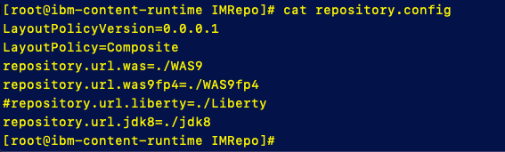
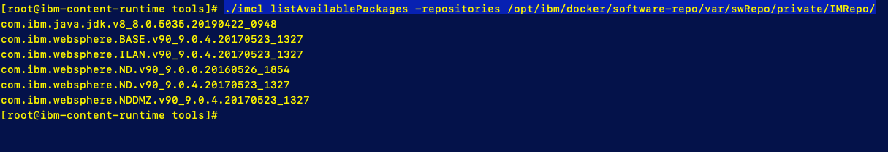

# Deploy Content Server

The Content Runtime is a virtual machine. A Chef server is installed on 
the virtual machine as part of the configuration of the Content Runtime.
Two docker containers are installed on the machine to help communicate 
with the Chef server and to manage
the software repository.

### Generate SSH public/private key pair

Before deploying the Content Runtime server, you will need a to create a public/private key pair for communication to the new Content Runtime server along with a 64bit encoded private key

1. In the boot node, open a terminal 

   - Log in as root, enter `sudo su -` , password = **passw0rd**

   - go to .ssh directory.  `cd ~/.ssh`

   - create new public/private key pair

     ```
     ssh-keygen -t rsa -f [team#-pm-keys] -N "" -C ""; base64 -w 0 [team#-pm-keys] > [team#-pm-keys].enc
     ```

   - This will create 3 files
     - **team#-pm-keys** : private key
     - **team#-pm-keys.pub** : public key
     - **team#-pm-keys.enc** : 64 bit encoded private key 

### Deploy WebSphere Content Runtime

##### Procedure

1. Start the creation process by displaying the menu on the top left corner in the Cloud Automation Manager user interface.

2. Select **Manage** > **Content Runtimes**. 

3. Click **Create Content Runtime**.

4. Enter a name for your Content Runtime. This name is used for  selecting environment value to inject, so the name should be  descriptive of the environment.  **Team#_CR_Server**

5. Select the Cloud Provider: **VMware vSphere**

6. Select a value from the Runtime drop-down list: **CAM Content Runtime **

7. Click **Create**. 

8. In the Deploy Runtime page, 

   - Select a  Namespace: **services** 
   - Select a  Cloud Connection: **Team#_VMware**
   - Select Data Object  
     
     - bastionhost: **DefaultNoBastionHostRedquired**
     - HTTP Proxy Configuration: **DefaultNoProxyrequired**
     
   - Cloud Provider
     
     - vSphere Datacenter: **Datacenter**
     - vSphere Disk Datastore: **D_S01_L01_500G** or **D-S02_L01_500G**
     - vSphere Default Resource Pool: **CAMPool**
     - vSphere Network Adapter Type: **vmxnet3**
     - Domain Name: **cam.local**
     - CPU cores: **4** 
     - RAM: **8 GB** 
     - OS Template Name:  **centos76-template**
     - Size of Disk image in GB's: **25**
     - Size of data disk in GB's: **100**
     - Network Interface label: **VM Network**
     - Static IPv4: **10.0.0.?? (team IP address ranges}**
     - Gateway IP adress: **10.0.0.254**
     - IPv4 prefix length: **24**
     - Template image user name: **root**
     - Template images password: passw0rd 
     - Template images private key for SSH connection: **not used**
   - Cloud Provider Optional
     - vSphere Folder: **Target/Team#**
     - Keep Disks on remove: **false**
     - DNS servers: **8.8.8.8**

   - Docker Chef Settings
     - Docker-chef_settings:  **hub.docker.com**
     - Chef server org name:  **chef-org**
     - Chef admin user: **chef-admin**
     - Chef version: **12.17.33**
   - Cam Parameters
     - Pattern Manager Access Passphrase: **passw0rd**
     
     - Pattern Manager Admin Passphrase: **passw0rd**
     
     - Key Name for Pattern Manager key set: **pmkeyset**
     
     - From generated public/private key set
     
       -Private key for Pattern Manger: copy key from **team#-pm-keys.enc**
     
       -Public Key for Pattern Manager: copy key from **team#-pm.key.pub**
     
     - User Public Key: **not needed**
     
     - Content Runtime Host Name: **team#-Ibm-content-runtime**
   - Software Repository Rettings
     - Software repo User Name/password:  **repouser / passw0rd**
     - Repo Port #:  **8888**
     - Repo secure Port #: **9999**
     - Software Repo Chef Client version: **14.0.190**
   - Additional Settings
     - Network visability: **public**
     - Prereq checker strictness: **Lenient**

9. Click **Deploy**.   my take 10 - 15 min to create


### Set up product repository

In thsi section you are goiung to createa siftware repoisitory that the IBM Installiation Manager can use to install the WebSphere Application Server into your Middleware Virtual Machine


1. Copy files from NFS server to CR server

   - From boot node terminal, Log ingo NFS server enter `ssh 10.10.1.6` / passw0rd

   - go to root directory

   - run  `scp -r ./export/WASND_binaries 10.0.0.###:~/binaries`

     The IP address of your teams Content Runtime Serverwill be  (10.0.0.???)

2. Set up Instaliation Manager software repository

   - copy Installiation manager to repository

     - go to the IM directory `cd /opt/ibm/docker/software-repo/var/swRepo/private/im/v1x/base`

     - Copy archive

       `cp ~/binaries/WASND_binaries/(Installiation Manager Archive)`

       Installiation Manager Archive - **agent.installer.linux.gtk.x86_64_1.8.8000.20171130_1105.zip**

3. Setup the WebSphere Software Repository

   - log into Content Runtime Server from boot node terminal,  

      `ssh 10.0.0.###` / passw0rd

   - Install **unzip** into the Content Runtime Server,  run  `yum install unzip`

   - Change to the following directory **/opt/ibm/docker/software-repo/var/swRepo/private/IMRepo**

   - Create the following directories off **…/IMRepo** 

     ​	-IMRepo/**WAS9**

     ​	-IMRepo/**WAS9fp4**

     ​	-IMRepo/**jdk8**

   - Run the following commands to unzip the WebSphere archives into thier repository locations

     -  for WAS BAse V9.0.0

       1) `cd /opt/ibm/docker/software-repo/var/swRepo/private/IMRepo/WAS9`

       2) `unzip ~/binaries/WASND_binaries/WAS_ND_V9.0_MP_ML.zip`

     - For WAS V9.0.0.4 Fix pack

       1) `cd /opt/ibm/docker/software-repo/var/swRepo/private/IMRepo/WAS9fp4`

       2) `unzip ~/binaries/WASND_binaries/9.0.0-WS-WAS-FP004.zip`

     - For JDK 8.0.5.35

       1) `cd /opt/ibm/docker/software-repo/var/swRepo/private/IMRepo/jdk8`

       2) `unzip ~/binaries/WASND_binaries/ibm-java-sdk-8.0-5.35-linux-x64-installmgr.zip`

     

   - Edit Composite **repository.config** file.  For this section you will need to use the VI Command line editor

     - `cd /opt/ibm/docker/software-repo/var/swRepo/private/IMRepo`

     - in this directory you will see the repository.config file

     - If you run `cat repository.config`, it will like this.

       

   - Edit the repository file

     - Uncomment the **WAS9** and the **jdk8** lines

     - Add the following line  for the WAS V9.0.0.4 Fix pack

       ` repository.url.was9fp4=./WAS9fp4`

   -   Your completed **repository.config** file should look like this:

     

     

4. Validate Installiation Manager repository

   - Create the IMTemp  directory in /opt/ibm/docker/software-repo/var/swRepo/private/**IMTemp**

   - From IMTemp dir run 

     `unzip ~/binaries/WASND_binaries/(Instaliation Manager Archive)  -d imtoolkit`

     Installiation Manager Archive - **agent.installer.linux.gtk.x86_64_1.8.8000.20171130_1105.zip**

   - Use the IMCL (Installiation Manager Comand Line) To validate the repository

     - Go to the **/opt/ibm/docker/software-repo/var/swRepo/private/IMTemp/imtoolkit/tools** directory

     - Run the following command 

       ```
       ./imcl listAvailablePackages -repositories /opt/ibm/docker/software-repo/var/swRepo/private/IMRepo/
       ```

       

     - You should see the following output




### 


