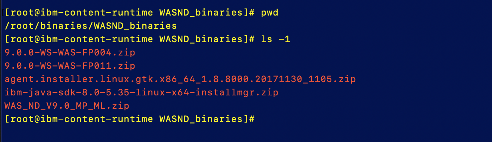
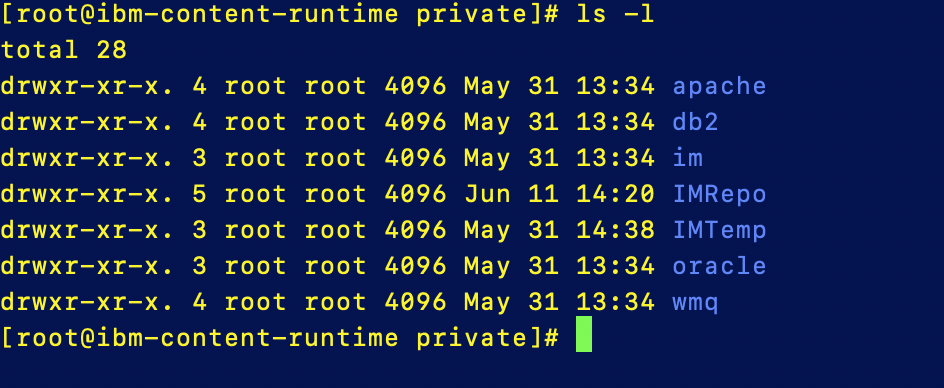
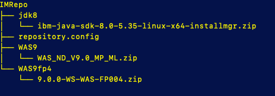
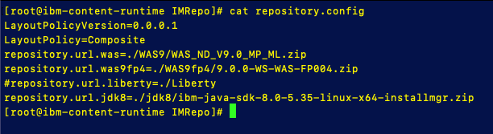

# Deploy Content Runtime Server

The Content Runtime Server (CRS) is a virtual machine that is used to store installation binaries and automation tools. A Chef server is installed on the Content Runtime Server as part of the configuration and the CAM Chef cookbooks are pulled down from the internet and installed there. In addition two docker containers are installed on the machine to help communicate  with the Chef server and to manage the software repository.

### Generate SSH public/private key pair

Before deploying the Content Runtime server, you will need a to create a public/private key pair for communication to the new Content Runtime server along with a 64bit encoded private key

1. On the **boot** node, open a terminal

2. Swith user to the root user

   ```
   sudo su -
   ```

3. Change directory to the ~/.ssh directory

   ```
   cd ~/.ssh
   ```

4. Execute the command below to create a new SSH Key (substitute your team #)

   ```
   ssh-keygen -t rsa -f team#-pm-keys -N "" -C ""; base64 -w 0 team#-pm-keys > team#-pm-keys.enc
   ```

   This will create 3 files

   - **team#-pm-keys** : private key
   - **team#-pm-keys.pub** : public key
   - **team#-pm-keys.enc** : 64 bit encoded private key 

### Deploy a Content Runtime Server

Follow the process below to deploy a Content Runtime Server

**Note:** Some of the empty fields will have a set of empty quotation marks. Remove the empty quotation marks in those fields before defining the values below.

1. Login to the Cloud Automation Manager console and navigate to the **Advanced Content Runtimes** management page

   Select **Menu** >**Manage** > **Content Runtimes**

3. Click **Create Content Runtime**

3. Enter the values below for your Content Runtime Server

   Name: **Team#_CR_Server** 

   Cloud Provider: **VMware vSphere**

   Runtime: **CAM Content Runtime**

4. Click **Create**

5. In the Deploy Runtime page enter the values below:

   - Select a  Namespace: **services** 
   - Select a  Cloud Connection: **Team#_VMware**
   - Select Data Object  
     
     - bastionhost: **DefaultNoBastionHostRedquired**
     - HTTP Proxy Configuration: **DefaultNoProxyrequired**
     
   - Cloud Provider
     
     - vSphere Datacenter: **Datacenter**
     - vSphere Disk Datastore: **D_S01_L01_500G** or **D_S02_L01_500G**
     - vSphere Default Resource Pool: **CAMPool**
     - vSphere Network Adapter Type: **vmxnet3**
     - Domain Name: **cam.local**
     - CPU cores: **4** 
     - RAM: **8 GB** 
     - OS Template Name:  **centos76-template**
     - Size of image disk in GB's: **25**
     - Size of data disk in GB's: **100**
     - Network Interface label: **VM Network**
     - Static IPv4: **Select an unused IP address from the range assigned to your team**
     - Gateway IP adress: **10.0.0.254**
     - IPv4 prefix length: **24**
     - Template image user name: **root**
     - Template images password: **passw0rd** 
     - Template images private key for SSH connection: **not used**
   - Cloud Provider Optional
     - vSphere Folder: **Target/Team#**
     - Keep Disks on remove: **false**
     - DNS servers: **8.8.8.8**

   - Docker Chef Settings
     - Docker-chef_settings:  **hub.docker.com**
     - Docker Enterprise Edition Repository URL: <Leave blank>
     - Chef server org name:  **chef-org**
     - Chef admin user: **chef-admin**
     - Chef version: **12.17.33**
   - Cam Parameters
     - Pattern Manager Access Passphrase: **passw0rd**
     
     - Pattern Manager Administration Passphrase: **passw0rd**
     
     - Key Name for Pattern Manager key set: **pmkeyset**
     
     - From generated public/private key set
     
       -Private key for Pattern Manger: copy key from **team#-pm-keys.enc**
     
       -Public Key for Pattern Manager: copy key from **team#-pm.key.pub**
     
     - User Public Key: **not needed**
     
     - Content Runtime Host Name: **team#-ibm-content-runtime**
   - Software Repository Settings
     - Software repo User Name/password:  **repouser / passw0rd**
     - Repo Port #:  **8888**
     - Repo secure Port #: **9999**
     - Software Repo Chef Client version: **14.0.190**
   - Additional Settings
     - Network visibility: **public**
     - Prereq checker strictness: **Lenient**

6. Click **Deploy**.   my take 10 - 15 min to create


### Set up product repository

In this section you are going to create a software repository that the IBM Installation Manager can use to install the WebSphere Application Server on provisioned virtual machine

1. Copy files from NFS server to the new Content Runtime  Server

   - From boot node SSH to the NFS server

     ```
     ssh root@10.10.1.6
     ```

   - Copy the files from the NFS server to the Content Runtime Server

     **Note:** Replace with the IP address of your CRS

     ```
     scp -r /export/WASND_binaries root@10.0.0.<your CRS IP>:/root/binaries/
     ```

   - Exit your SSH session to the NFS server

   - Now SSH to your Content Runtime Server

     ```
     ssh root@10.0.0.<your CRS IP>
     ```
     
   - You should now have a list of product archives in the Content Runtime server under `/root/binaries/WASND_binaries`

     

   

2. Next we will set up Installation Manager repository. The directory structure we are going to populate is a way to organize the product binaries for the Installation Manager to manage product installation archives.

   - Change to the Installation Manager directory

      ```
      cd /opt/ibm/docker/software-repo/var/swRepo/private/im/v1x/base
      ```

   - Move the  Installation Manager archive 

     ```
     cp /root/binaries/WASND_binaries/agent.installer.linux.gtk.x86_64_1.8.8000.20171130_1105.zip ./
     ```

3. Set up the WebSphere Application Server repository

   - Change to the /opt/ibm/docker/software-repo/var/swRepo/private directory

     ```
     cd /opt/ibm/docker/software-repo/var/swRepo/private
     ```

   - You will see the following directories here that we will copy the WAS binaries to

     

   - Go to the `IMRepo` directory

     ```
     cd IMRepo
     ```

   - In the IMRepo directory you will create the follwoing WebSphere repository directory structure

     - WAS9
     - WAS9fp4
     - jdk8

     ```
     mkdir WAS9
     mkdir WAS9fp4
     mkdir jdk8
     ```

   - Mope the WAS archives in to the new directory structure

     From the `IMRepo` directory run the following commands

     ```
     cp ~/binaries/WASND_binaries/WAS_ND_V9.0_MP_ML.zip WAS9/.
     cp ~/binaries/WASND_binaries/9.0.0-WS-WAS-FP004.zip WAS9fp4/.
     cp ~/binaries/WASND_binaries/ibm-java-sdk-8.0-5.35-linux-x64-installmgr.zip jdk8/.
     ```

   - The competed WebSphere repository structure should look like this

     

4. Update the **repository.config** file

   - Change to the IMRepo directory 

     ```
     cd /opt/ibm/docker/software-repo/var/swRepo/private/IMRepo
     ```

   - In this directory you will see the repository.config file. If you run `cat repository.config`, it will like this.

     

   - Edit the repository file

     - Uncomment the **WAS9** and the **jdk8** lines and add the name of the archive files to the path

       ```
       repository.url.was=./WAS9/WAS_ND_V9.0_MP_ML.zip
       repository.url.jdk8=./jdk8/ibm-java-sdk-8.0-5.35-linux-x64-installmgr.zip
       ```

     
     - Add the following line  for the WAS V9.0.0.4 Fix pack 
     
       ```
       repository.url.was9fp4=./WAS9fp4/9.0.0-WS-WAS-FP004.zip
       ```
     
     - Save your changes
     
     - Your completed **repository.config** file should look like this:


       


5. Next lets validate Installation Manager repository

   - Install **unzip** into the Content Runtime Server`

     ```
     yum install unzip
     ```

   - Create the IMTemp  directory

     ```
     mkdir /opt/ibm/docker/software-repo/var/swRepo/private/IMTemp
     ```

   - Change to the IMTemp directory
   
     ```
     cd /opt/ibm/docker/software-repo/var/swRepo/private/IMTemp
     ```
   
   - Unzip the IM installer with the command below

     ```
     unzip ~/binaries/WASND_binaries/agent.installer.linux.gtk.x86_64_1.8.8000.20171130_1105.zip -d imtoolkit
     ```
   
   - Use the IMCL (Installation Manager Command Line) o validate the repository
     - Change to the  `./imtoolkit/tools` directory
   
       ```
       cd /opt/ibm/docker/software-repo/var/swRepo/private/IMTemp/imtoolkit/tools
       ```
   
     - Run the following command 
   
       ```
       ./imcl listAvailablePackages -repositories /opt/ibm/docker/software-repo/var/swRepo/private/IMRepo/
       ```
   
   - You should see the following output

     

   
   
    **Your Content Runtime is now installed and configured.**


