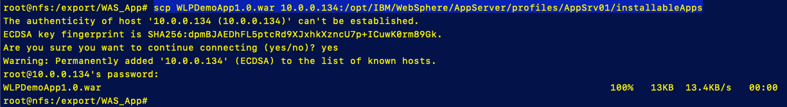

### 1. Deploy the WAS VM template

1. ​	in CAM go to **Library** > **Templates**

   - Select **Middleware**
   - In search bar, enter **WebSphere**

   - Scroll throuh templates until you find the following template

     **IBM WebSphere ND V9 on single Virtual Machine**  for **VMware vSphere** provider

2.  Deploy

   - Instance Name - **team#was9vm**

   - Name space - **services**

   - Cloud Connection - **Team#-VMware**

   - Select Data Objects - 

     - Bastion host - **default**
     - HTTP proxy Config - **default**
     - Advanced Content Runtime Chef -  **team#_CR_Server**

   - Cloud Input Variables 

     - vSphere Cluster - WASnode01: **DatacenterCluster**
     - vSphere Datacenter - WASNode01:  **Datacenter**
     - vSphere Folder Name - WASNode01: **Target/Team#**

   -  SSH-Keys : **None**

   - Virtual Machine

     - DNS Servers - WASnode01: **8.8.8.8**
     - DNS suffixes - WASNode01: **cam.local**
     - Domain Name - WASNode01: **cam.local**
     - Operating System ID / Template - WASnode01: **rhels76-template**
     - operating System username - WASNode01: **root**
     - operationg System password - WASNode01:  **passw0rd**
     - Root Disk Size - WASNode01: default - **100**
     - Short hostname - WASNode01: **team#washost**
     - Template Disk Datastore - WASNode01:  **D_S01_L01_500G** or **D_S02_L01_500G**
     - Virtua Machine Gateway Address - WASNode01:  **10.0.0.254**
     - Virtual Machine IP address - WASNode01: 1**0.0.0.{within team IP range}**
     - Virtuial Machine Memory - WASNode01:  default - **4096**
     - Virtual Machine Netmask prefix - WASNode01:  **24**
     - Virtual Machine vCPU's - WASNode01:  default - **2**
     - Virtual Machine vSphere Port Group - WASNode01: **VM Network**
     - vSphere Network Adapter Type - WASNode01: **vmxnet3**
     - vSphere Resource Pool - WASNode01:  **CAMPool**

   - WASNode01

     - WebSPhere Application Server version : **9.0.0.4**
     - WebSPhere Application Server cell name:  **cell01**
     - WebSPhere Application Server max JVM Heap Size: **512**
     - WebSPhere Application Server profile name:  **AppSrv01**
     - WebSphere Java SDK version:  **8.0.5.35**
     - WebSphere administrative user name:  **wasadmin**
     - WebSphere administrative password:  **passw0rd**
     - WebSphere default keyatore password:  **passw0rd**
     - WebSphere Installiation userid:  **wasadmin**
     - WebSp[here profile location:  **/opt/IBM/WebSphere/AppServer/profile**
     - WebSphere user group[ name: **wasgrp**

     

### 2. Check WAS VM

If the Template has deployed sucessfully, you should have a Virtual Machine with WebSphere Application Server  base edition installed, up and running. 

##### Check the status of the WAS App Server

1. SSH into the App Server vm

   ​	`ssh 10.0.0.(WAS App Server vm IP)`

2. Go to the profile  `cd /opt/IBM/WebSphere/AppServer/profiles/AppSrv01/logs/server1`

3. check startServer log, run  `cat startServer.log`

   You should see "**open for e-business**" at the bottom of the log

##### Start WebSphere Admin Console

1. Add the following ports to the firewall

   - Run the following command for each of the following port

     `firewall-cmd --permanent --add-port=<port_here>/tcp`

     - 9060
     - 9043
     - 9080

   - Restart the firewall

      run `firewall-cmd --reload`

   - Check status of firewall

     Run `firewall-cmd --list-all`, you should see the following

     

2.  Open Admin console 

   - Go to the a node with a browser and open a browser

   - Go to **10.0.0.{WAS VM IP}:9060/ibm/console**  

     User id = wasadmin

     Password = passw0rd

### 3. Deploy simple application

1. Copy Application to WAS VM

   - From the boot node terminal, Log into NFS server enter `ssh 10.10.1.6` / passw0rd

   - go to /export/WAS_App directory

   - run  `scp WLPDemoApp1.0.war 10.0.0.###:/opt/IBM/WebSphere/AppServer/profiles/AppSrv01/installableApps`

     

     The ip address of your teams WebSphere VM will be  (10.0.0.???)

2. Open WebSphere admin console

   - in a browser go to **10.0.0.(*team# WAS IP address*):9043/ibm/console**

3. in Adminconsole go to **Application > New Appication**

   - Select **New Enterprise Application**

   - Select **Remote File System** (you are running the admin console remotly from your WAS VM )

     - Browse, select **team#washosteNode01**

     - Drive down into the **/opt/IBM/WebSphere/AppServer/profiles/AppSrv01/installableApps** directory

     - Select the **WLPDemoApp1.0.war** file

       

     - Select **OK**

     - Select **Next**

     - Select **Fast Path**, then **Next**

     - Step 1 Select **Next**

     - Step 2 Select **WLPDempApp**, then **Next**

     - Step 3 Select **WLPDemoApp**, then **Next**

     - Step 4 enter **WLPDemoAppV1Team#** for context root, then **Next**

     - Step 5 select **Next**

     - Step 6 select **Finish**

     - Select **save** to save the changes to the master configuration

4. Restart the WebSphere server

   - SSH into WebSphere VM  `ssh 10.0.0.{Team WAS VM IP}`
   - go to App Server bin directory

   `cd /opt/IBM/WebSphere/AppServer/profiles/AppSrv01/bin`

   - Stop the server, run `./stopServer.sh server1`

     

   - Start the server, run `./startServer.sh server1`

     

4. Make sure App is started

   - From the boot node, log back in to the admin console 

     **10.0.0.(*team# WAS IP address*):9043/ibm/console**

   - open **Applications > Application Types** and select **WebSphere enterprise applications**

   - You should see a green arrow next to the **WLPDemoApp1_0_war**

     

5. Open the Application

   - from a browser Log onto app -> 

     **10.0.0.(team WAS IP):9080/WLPDemoAppV1Team#/DemoApp_Begin.jsp**

     

#### Lab Completeion Clean Up

To remove the instances used during this lab and the previous one, first remove the WAS VM via CAM Menu -> Deployed Instances -> Templates.

Next remove the content runtime VM using CAM Menu -> Manage -> Content Runtimes. Click on the 3 dots to the right of the instance created and click on 'Destroy Resources' followed by 'Delete Instance' 

