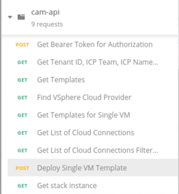
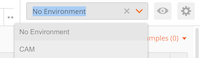
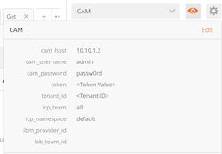
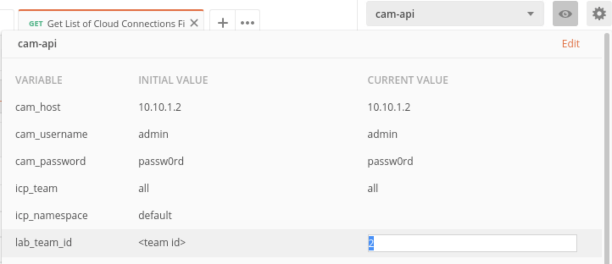
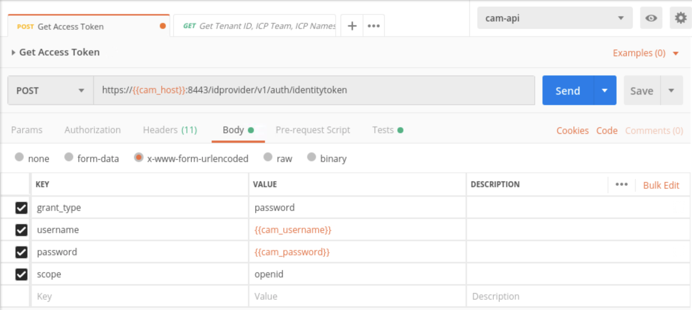
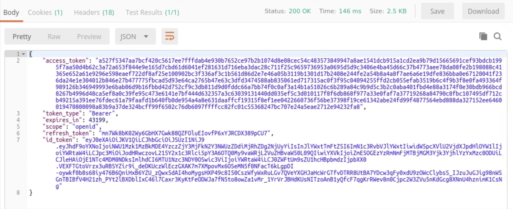
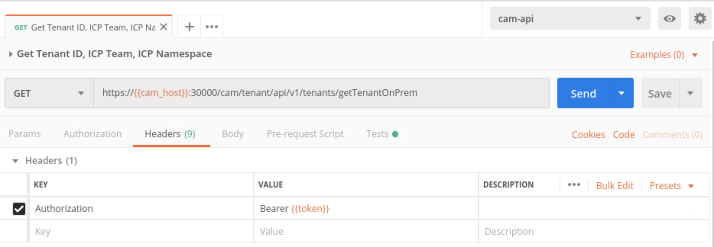
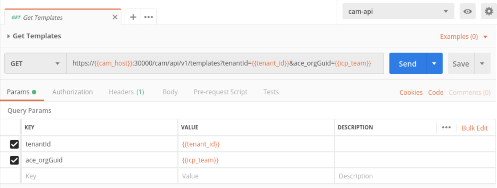

#  CAM by API

This lab will walk you through using the CAM Rest API and how you can use Postman collections and environments to test functions of the API.

**Note:** This lab will be rexecuted on the **boot** node.

### Lab Setup

You can install the Postman extension using this link: 

https://chrome.google.com/webstore/detail/postman/fhbjgbiflinjbdggehcddcbncdddomop

To install Postman, just click the button "Add to Chrome" and confirm that you want to install it

When Chrome is opened, you can access to your applications (extensions) entering `chrome://apps` in your Chrome address bar.  

Click the `Postman` icon to open Postman application.  A window warns you that this chrome app is being deprecated. Do not download the native application. Just close the window to ignore this warning message.

Notice that, you don't need to create a postman account for this lab.  Just click on the link "Take me straight to the app."

### Importing Postman Collection
A Postman collection *cam-api.postman_collection.json* has been prepared in the git repo under the "cam-api" directory.

Follow the steps below to import the CAM Postman collection

1. Click **Import** in the upper lefthand corner.
1. Select **choose files** and specify ***cam-api.postman_collection.json*** located in the directory you have cloned from github in a previous lab (~/Documents/cam-admin-bootcamp/cam-api)
1. On the left sidebar a new collection should now exist called `cam-api`.  
1. Click on "cam-api" collection to display the collections
1. Explore through each of the requests taking note the request type (GET, POST, DELETE) the url endpoint for the request.

### Importing Postman Environment
Postan environment can be used to store and pass variables across REST calls. For this lab we have created an environment file that we will need to import. Importing the environment file is the same as importing a collection. 

1. From Postman, click **Import**
1. Select **Choose Files** and specify ***cam-api.postman_environment.json*** from the same "cam-api" directory as the Postman collection we previously imported

### Configure Environment variables

Environments can be selected in the upper righthand of the UI

1. Click on the dropdown list and select cam-api

   

2. Select the eye next to the dropdown. This will allow you to see the initial and current environment and global variables.

   
   
3. Click **Edit** and change the lab_team_id to your team #

   

5. Click **Update**

## Common Rest APIs Services

### Get an access token

Before we can make any of the other REST API calls we first need to create an access token. This access token will get assigned to an environment variable and will be used for subsequent REST calls.

1. From the "cam-api" collectin select the **Get Access Token** request

1. Click on **Body** and inspect the input parameters.

    

    Notice how Postman indicates variables using `{{  }}`.
    
    For example, `{{cam_username}}` corresponds to the environment variable we imported from *cam-api.postman_environment.json*.

1. Click on **Tests** and inspect see how response code should be `200` then a global variable `token` is being set from the `access_token` in the response.

1. Click **Send**.

1. Click on **Body** below the request.

1. Verify the response has an `access_token` and `expires_in` fields

7. Click on the Tests tab and verify the response code test passed.

8. Click on the eye icon next in the environment dropdown and see value is now set for global variable `token`

### Get Query Params

In this call we will get the tenant ID field which will be used for subsequent calls

1. Click on the **Get Query Params** request.

1. Click on **Headers** and inspect the input headers.

    

    Notice how in this request the global variable {{token}} is now be used that we set in the test of the previous request to get access token.

1. Click on **Tests** and inspect see how response code should be `200` then a global variable `tenant_id` is being set from the `id` in the response.

1. Click **Send**.

1. Click on **Body** below the request. Inspect the response taking note of the `id` and list of `namespaces`.

1. Click on the test and verify the response code test passed.

1. Click on the eye icon next in the environment dropdown and see value is now set for global variable `tenant_id`.

### Get templates

This REST call will query CAM for the list of Templates

1. Click on the **Get Templates** request.

1. Click on **Params** and inspect the Query Params being set to the global variable `{{tenant_id}}` and environment variable `{{icp_team}}` as shown in the **Get Query Params**.

    

1. Click **Send**.

1. Click on **Body** below the request. Inspect the response.

1. Click on the test and verify the response code test passed.

### Get VSphere Cloud Provider

This will list the required parameters for the VMware vSphere Cloud Connection

1. Click on the **Get VSphere Cloud Provider** request.

1. Click on **Params** and inspect the new query param `filter` for `{"where": {"name": "VMware vSphere" }}`.

1. Click **Send**.

1. Click on **Body** below the request. Inspect the response.

1. Click on the test and verify the response code test passed.

### Get the VSphere Cloud Connection (filtered)

This will return the values for a specific VMware vSphere Cloud Connection

1. Click on the **Get List of Cloud Connections Filtered** request.

1. Click on **Params** and inspect the query param `filter` for `{"where": {"name": "Team{{lab_team_id}}_camlab" }}`

    **Note:** If required, you may need to change the `filter` field to match the name of the CAM Cloud Connection you have created in the previous labs.

3. Click on **Tests** and inspect see how response code should be `200`, the connection should validate successfully, and a global environment variable is being set for `vsphere_connection`
4. Click **Send**.
5. Click on **Body** below the request. Inspect the response.
6. Click on the test and verify the response code test passed. Click on the eye icon next to the environment variable drop down list and look to see there is now a global parameter called `vsphere_connection` with a current value.

### Get the template for SingleVirtualMachine from list of templates

Returns the values for a specific CAM Template

1. Click on the **Get Template for Single VM** request.

1. Click on **Params** and inspect the new query param `filter` for `{"where": {"name": "SingleVirtualMachine" }}`.

1. Click on **Tests** and inspect see how response code should be `200` then a global variable `templateId` is being set.

1. Click **Send**.

1. Click on **Body** below the request. Inspect the response.

1. Click on **Tests** and verify the response code test passed.

### Deploy the SingleVirtualMachine template
1. Click on the **Deploy Single VM Template** request.

1. Click on **Body** and inspect the payload for deploy single virtual machine request. Take note the `{{vsphere_connection}}` and `{{template_id}}` stored from *Get Cloud Connections Filtered* and *Get Template for Single VM* respectively.

1. Click on **Tests** and inspect see how response code should be `200` and a global environment variable is being set for `stackId`.

1. Click **Send**.

1. Click on **Body** below the request. Inspect the response. 

1. Click on **Test** and verify the response code test passed. Click on the eye icon next to the environment variable drop down list and look to see there is now a global parameter called `stackId` with a current value.

### Get stack instance
1. Click on the **Get Stack Instance** request.
1. Click on **Body** and inspect the payload for deploy single virtual machine request. Take note the `{{stackId}}` stored from *Deploy Single VM Template*
1. Click on **Tests** and inspect see how response code should be `200`
1. Click **Send**.
1. Click on **Body** below the request. Inspect the response. 
1. Click on **Test** and verify the response code test passed. 

## Onboard and existing VM

First we need to delete the previous CAM Template instance so we create a scenario where we have an orphaned virtual machine to import. Then we can make the Import REST API call.

1. Login to CAM and delete he Template instance created in the previous step (IBMCloudTest_team#)

   **Note:** Make sure to **Delete** the instance not Destroy.

2. Return to Postman and select the **Import VM by Name** request and click **Send**

3. Return to CAM and monitor your Template intances. When it is complete you should now be able to manage the imported virual machine. 

## Resources

CAM APIs and Examples, Hugh Hockett, (https://developer.ibm.com/cloudautomation/tutorials/cam-api-examples/)

Common Cloud Automation Manager APIs, Knowledge Center, (https://www.ibm.com/support/knowledgecenter/en/SS2L37_3.1.2.1/cam_common_API.html)
