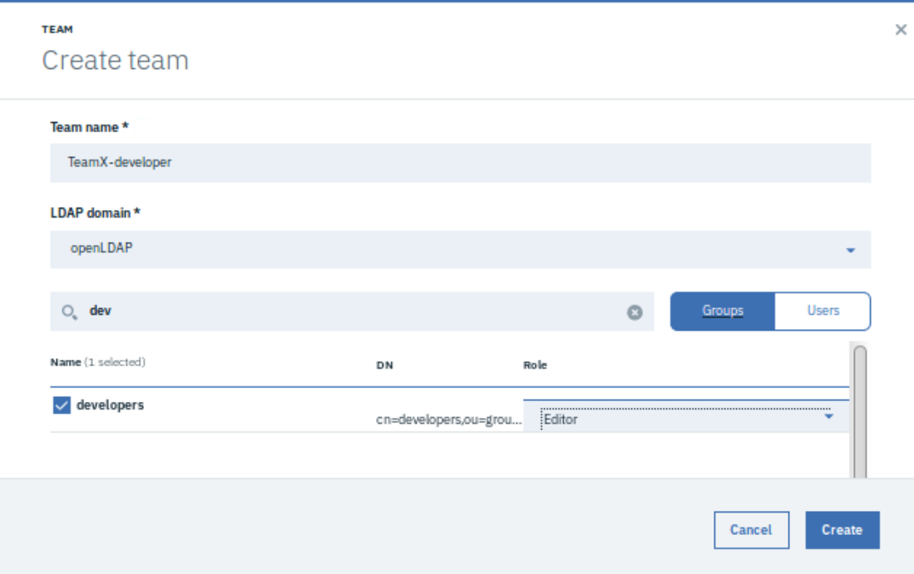

# CAM RBAC Overview

The lab will walk through setting up **Teams** who will be responsible for different namespaces, each with a different level of responsibility (role). Followed by a few simple test scenarios to demonstrate how teams can be used to limit who-can-do-what.

# Readying your environment

An LDAP has already been installed on the Boot node and contains the following groups / users ...

| Group      | Users  |
| ---------- | ------ |
| developers | james  |
|            | sarah  |
|            | todd   |
| operations | bob    |
|            | josie  |
|            | laura  |
| support    | carlos |
|            | jackie |
|            | tony   |

Now we need to create a connection from ICP to the LDAP. 

**NOTE: This has already been pre-configured for this class and is therefore not a required step. These instructions are for reference only**

1. Login into the ICP UI as **admin** using the web browser on the Boot node

2. Click on Menu -> Manage -> Identity & Access -> Authentication

3. Click on **Create Connection**

4. Fill out the following parameters
   ```
   Connection name:  `openLDAP`

   Server type: `Custom`

   Base DN:  `dc=ibm,dc=com`

   Bind DN:  `cn=admin,dc=ibm,dc=com`

   Bind DN Password:  `Passw0rd`

   URL:  `ldap://10.1.171.80:389`

      NOTE: Click on the 'Test connection' button to confirm you have entered the correct information 
   
   Group filter:  `(&(cn=%v)(objectclass=groupOfUniqueNames))`

   User filter:  `(&(uid=%v)(objectclass=inetOrgPerson))`

   Group ID map:  `*:cn`

   User ID map:  `*:uid`

   Group member ID map:  `groupOfUniqueNames:uniqueMember`
   ```
   Click on the **Create** button

## Create the Teams

Configuring roles and responsibilities for both ICP and CAM is defined via ICP.

In summary, a **team** is allocated a number of resources and given a level of responsibility for those resources.

To create a team follow these instructions ....

1. Login into the ICP UI as **admin** using the web browser on the Boot node

2. Click on Menu -> Manage -> Identity & Access -> Teams

3. Click on **Create team**

   The following popup screen is presented ..

   

4. Create these teams with the following roles ...

      | Team   Name             | LDAP Domain | Groups     | Users | Role     |
      | ----------------------- | ----------- | ---------- | ----- | -------- |
      | TeamX-developer-lab     | openLDAP    | developers |       | Editor   |
      | TeamX-developer-default | openLDAP    |            | james | Editor   |
      | TeamX-DevOps            | openLDAP    | operations |       | Operator |
      | TeamX-support-lab       | openLDAP    | support    |       | Viewer   |
      | TeamX-support-default   | openLDAP    |            | tony  | Viewer   |

5. Now we have to assign the resources these team will be responsible for. To do this, assign each team specific resources. 

      i. Click on the team name 

      ii. Click on the **Resources** tab

      iii. Click on the **Manage resources** button. This will present a list of possible resources the team can be allocated responsibility for. This includes namespaces, helm repositories (pulled in from ICP) and directory servers

6. Assign these resources to the relevant teams

      | Team   Name             | Resources Type  | Resource Name |
      | ----------------------- | --------------- | ------------- |
      | TeamX-developer-lab     | Namespace       | ldap-lab      |
      |                         | Helm repository | ibm-node-js   |
      |                         | Helm repository | ibm-nginx-dev |
      | TeamX-developer-default | Namespace       | default       |
      |                         | Helm repository | ibm-node-js   |
      |                         | Helm repository | ibm-nginx-dev |
      | TeamX-DevOps            | Namespace       | ldap-lab      |
      |                         | Namespace       | default       |
      |                         | Helm repository | ibm-node-js   |
      |                         | Helm repository | ibm-nginx-dev |
      | TeamX-support-lab       | Namespace       | ldap-lab      |
      |                         | Helm repository | ibm-node-js   |
      |                         | Helm repository | ibm-nginx-dev |
      | TeamX-support-default   | Namespace       | default       |
      |                         | Helm repository | ibm-node-js   |
      |                         | Helm repository | ibm-nginx-dev |

## Test Case Scenarios

The following set of actions will demonstrate how different users will have the ability to carry out different tasks based on the team they are assigned to.

All these actions will be carried out via the CAM web interface.

To switch users, logout using the profile icon in the top right on the page and select **Log Out**. This will take you back to the ICP login screen. Afterwards login as the next user and navigate back to the CAM UI using http://10.10.1.2:30000/

### Test Case 1 - Bob the Operator

Bob (bob) is part of the **operations** LDAP group, which is assigned to the **TeamX-Operators** team with an **Operator** role.

| Task                                         | Activity                                                     | Result  | Reason                                                       |
| -------------------------------------------- | ------------------------------------------------------------ | ------- | ------------------------------------------------------------ |
| Deploy a   service                           | Deploy the service which you created in the 4-3_DeployToICP lab to **default** namespace | Success | Having the Operator role allows the deployment of services and because both namespaces were allocated to his team he could manage both default and ldap-lab. As an Operator, he can only deploy services, he can in no way edit or publish services |
| Deploy   a service                           | Deploy the service which you created in the 4-3_DeployToICP lab to **ldap-lab** namespace | Success | As above                                                     |
| Create   a new cloud connection              | Following the instructions in lab 1-2_ConfigureCAM, try and create a new cloud connection | Failed  | The Operator role does not have   the ability to create new cloud connections. Only the Administrator has this   ability |
| Moving   the service to a different category | Find the service you created in the earlier lab using Menu -> Library -> Services. <br>Click on the options to the left and select **Move to …** <br>Select a new category to move this service to | Failed  | The Operator role does not have   the permission to move services. Only and Administrator or an Editor can carry out this task |

### Test Case 2 - Jackie from Support

Jackie (jackie) is part of the **support** LDAP group, which is assigned to the **TeamX-support-lab** team with a **Viewer** role.

| Task                            | Activity                                                     | Result | Reason                                                       |
| ------------------------------- | ------------------------------------------------------------ | ------ | ------------------------------------------------------------ |
| Deploy   a service              | Deploy the   service which you created in the 4-3_DeployToICP lab | Failed | Note that the deployment only   failed at the every end when the Create Instance was pressed. As a Viewer she can only manage previously deployed instances. Also note   that she could only select ldap-lab as a namespace |
| Terminate   an instance         | Try to terminate one of the instances created as 'bob' in the previous set of tasks | Failed | Again as a Viewer, Jackie does not have the ability to change the state of any   instances |
| Create   a new cloud connection | Following the instructions in lab 1-2_ConfigureCAM, try and create a new cloud connection | Failed | The Viewer role does not have   the ability to create new cloud connections. Only the Administrator has this ability |

### Test Case 3 - Sarah the Editor

| Task                                         | Activity                                                     | Result                                                       | Reason                                                       |
| -------------------------------------------- | ------------------------------------------------------------ | ------------------------------------------------------------ | ------------------------------------------------------------ |
| List   deployed services                     | Use Menu ->   Deployed Instances -> Services                 | Success but with limited scope   i.e. ones deployed against ldap-lab namespace | Because Sarah's group   (developers) is assigned to the team called TeamX-developer-lab, only the   instances deployed using ldap-lab namespace will by visible |
| Terminate   an instance                      | Try to terminate one of the   instances created as 'bob' in the previous set of tasks | Success                                                      | As Sarah is part of the team   assigned the Editor role, she can fully manage instances |
| Deploy a   service                           | Deploy  the service which you created in the 4-3_DeployToICP lab. Note that only the ldap-lab namespace is a selectable option | Success                                                      | Having Editor role gives full   management of templates and services (including publishing) |
| Create a new   cloud connection              | Following the instructions in lab 1-2_ConfigureCAM, try and create a new cloud connection | Failed                                                       | Again, this activity is only   permitted if you are the administrator |
| Moving the   service to a different category | Find the service you created in the earlier lab using <br>Menu -> Library ->   Services.<br> Click on the options to the left and select **Move to …** <br>Select a new category to move this service to | Success                                                      | The Editor role gives permits   full management of the service |

## Useful References

A comprehensive list of the User Role Permissions can be found here 

<<https://www.ibm.com/support/knowledgecenter/en/SS2L37_3.1.2.1/cam_roles_namespaces.html>>
