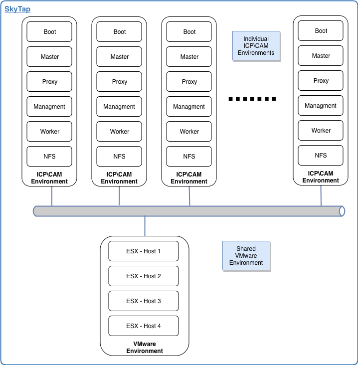
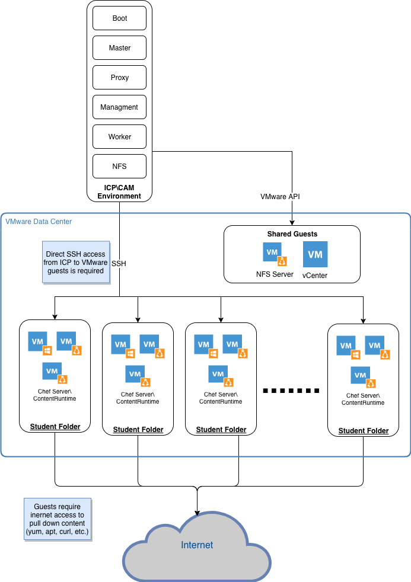

# SkyTap Lab Evironment

The target ICP environment is a single master environment with a boot node that can be used as a client machine to access the environment.

**Server specs for the environment**

| **Server** | **CPU** | **Memory** | **Storage** |
| ---------- | ------- | ---------- | ----------- |
| Boot       | 2       | 8GB        | 250GB       |
| Management | 8       | 16GB       | 500GB       |
| Master     | 16      | 32GB       | 500GB       |
| NFS        | 4       | 8GB        | 500GB       |
| Proxy      | 4       | 16GB       | 500GB       |
| Worker     | 8       | 16GB       | 500GB       |

Each student\team will have their own ICP environment to use throughout the class.

Below is a high-level diagram of the ICP\CAM lab environments for the CAM for Administrators enablement.

The environment would consist of multiple ICP environments and a single shared VMware environment as the "managed to" hypervisor. Each environment would be on it's own separate private 10.x.x.x network. 

From a network perspective we would need to create some routing rules for the ICP environments to be able to communicate with the VMware environments.

Each ICP environment will need to talk to the shared VMware environment via the VMware API to provision and manage VMware guests and via SSH to execute pro-provisioning tasks and troubleshoot.

All VMware resources will be shared by all students and there will only be logical separation of resources from the student perspective via Folders.
